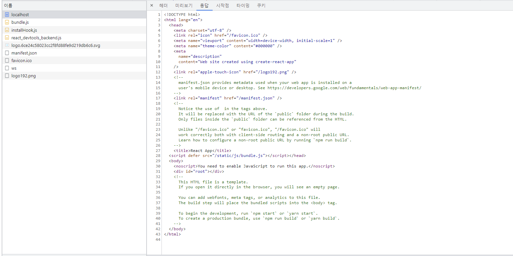
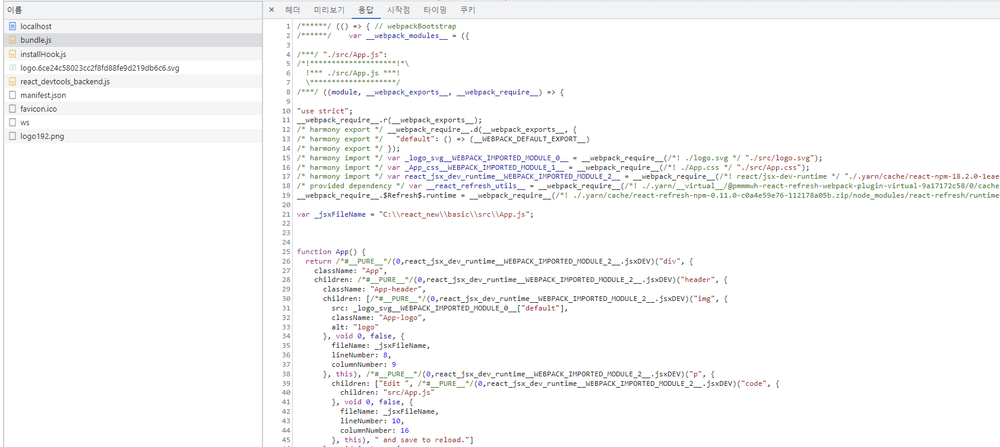
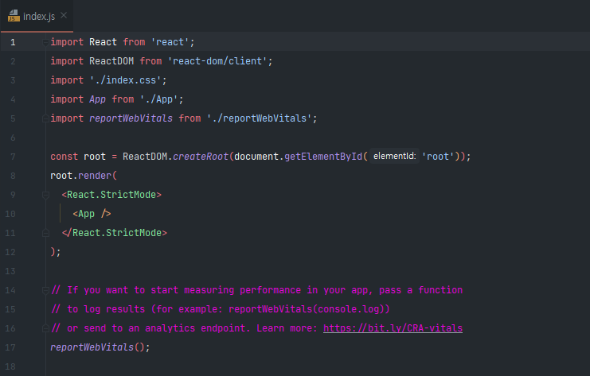

## CRS(Client Side Rendering)
  
  
계발자 도구를 통해서 확인해보면 처음에 localhost 라는 `document` 가 다운받아졌는데 이 문서가 우리가 보고있는 `HTML`페이지 이다.  
해당 문서를  확인해보니 사용자에게 보여지는 `<body>`를 `<div id ="root">` 말고는 아무것도 없는 것을 확인할 수 있다.  

  
  
### 근데 위의 화면 처럼 어떻게 이런 화면을 사용자가 볼 수 있는 것일까??
  

그 이유는 바로 `bundle.js` 파일이 있기 때문이다.  
우리 프로젝트를 브라우저에 보여주기 이전에 `Webpack`이 우리의 코드들을 위의 사진처럼 압축해서 준다.  
그래서 `Webpack`이 우리의 application 의 코드와 react 코드를 함께 묶어서 하나의 파일인 `bundle.js`로 만들어 준다.
그밖에 react_devtool 에 관련된 것들과 정적인 이미지들 ico, json 파일들이 함께 전송된다.  
**포인트는** 사용자가 `HTML`를 받았을때 페이지 소스를 확인해보면 `HTML`안에는 텅텅 비어져있다.(어떤 UI도 없다)  
  
왜냐하면 React 는 `Client Side Rendering` 이기 때문에 텅빈 HTML 파일과 우리 작성한 코드와 React 코드가 함꼐 전송이 되면서  
`Client Side` 에서 우리 코드가 동작이 되면서 우리가 작성한 코드대로 필요한 `DOM`요소(브라우저 UI 요소)를 동적으로 다이나믹하게 생성해준다.  
  
## React의 시작
  

```
const root = ReactDOM.createRoot(document.getElementById('root'));
```
우리가 보는 `index.html`은 `public` 디렉토리 안에 있고 React의 시작점은 `src` 디렉토리 안에 있는 `index.js`에서 부터 시작한다.  
위의 코드를 보면 ` ReactDOM`에 `createRoot`라는 API를 사용해서 우리 `HTML Document`에 있는 `root라는 이름의 id 태그`를 가지고 와서  
거기에 `root`를 만들어 준다.  
```
root.render(
  <React.StrictMode>
    <App />
  </React.StrictMode>
);
```
그래서 이 `root`에 우리의 첫번째 component를 rendering 할건데 그게 바로 `<App/>`이라는 component 이다.  
여기서 우리의 첫번째 component `<App/>`은 ` <React.StrictMode>` strict mode 롤 감싸져 있는데  
이 ` <React.StrictMode>` 모드는 Javascript 에서 `use strict`을 활성화 시키는 것처럼 동작한다.  
이때 계발할때만 엄격 모드가 적용되고 배포할때는 자동적으로 이 모드가 해제된다.  
즉, 계발하는 당시에만 무언가 잘못작성했을때 경고를 받아볼 수 있도록 하기 위해서이다.  
  
정리 하자면 브라우저에서 id 가 root인 요소를 찾아서 root 라는 가상의 요소를 만들고  
여기에 우리의 `<App/>` 이라는 component 를 연결시켜주는 것이다.  
그러면 React 가 내부적으로 `App` component로 들어가서 return 되는 `jsx`믄법을 확인한 다음에 어떤 태그를 만들어야 되는지 확인한 후  
브라우저에서 제공하는 `createElement`라는 동적으로 `DOM`요소를 생성하는 API를 사용해서 만들어야할 태그를 순서대로 생성해준다.  
  
  
## component 수정시 발생하는 오류 대처  
```
Compiled with problems:X

ERROR

[eslint] Failed to load config "react-app" to extend from.
Referenced from:
```  
발생원인은 create react-app 과 yarn 이 서로 충돌하기 떄문이다.  
따라서 `eslint`에 관련된 설정을 수동으로 설정해 줘야된다.  
1.해당 명령어를 추가해준다.
```
yarn add -D eslint-config-react-app
```  
2. 만약 설정후에도 해당 에러가 발생한다면  
```
Compiled with problems:X

ERROR

[eslint] Plugin "react" was conflicted between "package.json » eslint-config-react-app » C:\react_new\basic\.yarn\__virtual__\eslint-config-react-app-virtual-917c289b5c\0\cache\eslint
-config-react-app-npm-7.0.1-78bab43841-a67e082180.zip\node_modules\eslint-config-react-app\base.js" and "BaseConfig » C:\react_new\basic\.yarn\__virtual__\eslint-config-react-app-virtual-ed176a7a96\0\cache\eslint
-config-react-app-npm-7.0.1-78bab43841-a67e082180.zip\node_modules\eslint-config-react-app\base.js".
```  
  
3. 제일 상위에다가 `.yarnrc.yml` 파일을 만든후  
```
packageExtensions:
  react-scripts@*:
    peerDependencies:
      eslint-config-react-app: "*"
```  
해당설정을 추가해준다.  
```
packageExtensions:
  react-scripts@*: <- 기본적으로 모든 react scripts를 사용하고 있는데
  peerDependencies를 eslint 만큼은 우리가 설치한 것을 수동적으로 사용해줘~
```  
  
4. 만약 그후에도 오류가 난다면  
```
yarn cache clean
yarn install
```  
캐시를 삭제한후 `yarn install`로 다시 프로젝트를 세팅한 후 `yarn start`를 시작해본다.  
  
## JSX(JavaScript XML)  
  
먼저 component를 만들려면 함수 형태와 클래스 형태로 만들 수 있다.  
이때 함수로 생성시 함수 이름은 무조건 대문자로 시작해야 된다. 반환 값으로는 `JSX` 문법을 이용해서 UI 를 표기해야되는지 return 해 줘야 된다.  
  
JSX(JavaScript XML)은 `HTML` 유사하고 또 HTML 처럼 사용할 수 있다 이때 3가지 유의사항이 있다.  

1. JSX 를 return 할때는 반드시 하나의 태그만 return 해야된다.
   1. 이때 다수의 태그를 반환하고 싶다면 부모 태그로 한번더 감싸줘야 된다.
   2. 만약 이때 어떤 CSS 때문에 부모 태그로 감싸는 것이 아니라면 `<> </>` 빈 태그로 묶어서 반환해도 된다.
   3. React 내부적으로는 `<Fragment></Fragment>` 태그를 이용한다.  
```
        <Fragment>
            <h1>Hello</h1>
            <h2>Heelo</h2>
        </Fragment>
```
```
        <>
            <h1>Hello</h1>
            <h2>Heelo</h2>
        </>
```
2. HTML 에서는 class 를 사용하지만 `JSX`는 `className`을 이용해야 된다.
   1. 이게 가능한 이유는 `App.js`파일에서 `import './App.css';`를 import 하기 때문이다.
```
import logo from './logo.svg';
import './App.css';

function App() {
    return (
        <>
            <h1 className='orange'>Hello</h1>
            <h2>Heelo</h2>
        </>
    );
}
```  

3. 이렇게 JSX 는 `HTML` 처럼 작성할 수 있지만 작성하는 공간이 js 파일이기때문에 JavaScript 역시 작성할 수 있다. 이때 JavaSCript 코드는 `{}`안에 작성한다.
   1. 이때 함수 안의 변수에 접근할때 `{}` 사용하지 않으면 문자로 인식해서 name 이 그대로 화면에 보여진다. `{}` 사용하면 변수에 접근에 `mason`값이 보여진다.
   2. 즉 JavaScript 코드를 작성할때는 `{}`를 이용해서 묶어 줘야 한다.
   3. 이미지 태그의 `width={{width:'200px',height:'200px'}}` 이것 역시 width 에 `JavaScript` 객체형태로 값을 전달 하기때문에 이역시 JavaScript 문법을 사용하므로 `{}`를 2번 사용하는 것이다.

```
function App() {
    const name = 'mason';
    return (
        <>
            <h1 className='orange'>Hello</h1>
            <h2>Heelo</h2>
            <p>name</p>
            <p>{name}</p>
            <ul>
                <li>우유</li>
                <li>딸기</li>
                <li>바나나</li>
            </ul>
            
        </>
    );
```    
  
4. 추가적으로 `JSX` 문법을 사용할때 문자열과 JavaScript 변수를 같이 사용하고 싶을때는 어떻게 할까 바로 string template를 사용하면 된다.
```
function App() {
    const name = 'mason';
    return (
        <>
            <h1 className='orange'>{`Hello ${name}`}</h1>
        </>
    );
}
```  
  
5. `JSX` 에서 사용하는 반복분
   1. 먼저 JavaScript 문법을 사용하기때문에 `{}`를 사용
   2. map 함수를 이용해서 새로운 배열로 return 해주는데 그때 JSX 문법의 tag를 return
   3. 이때 값에 접근할때도 `{}`를 통해서 접근해야된다. 안그러면 문자로 인식한다.
```
function App() {
    const name = 'mason';
    const list  = ['유유','딸기','바나나']
    return (
        <>
            <ul>
                {
                    list.map(item => (
                        <li>${item}</li>
                    ))
                }
            </ul>
        </>
    );
}
```
  
[HTML을 JSX 변환해주는 사이트](https://transform.tools/html-to-jsx)