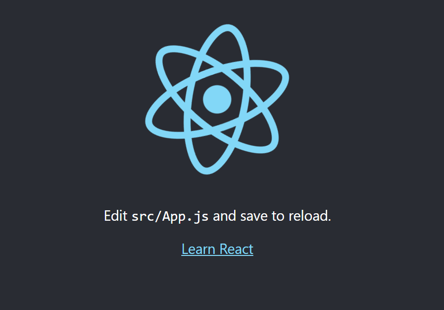

## CRS(Client Side Rendering)
  
  
계발자 도구를 통해서 확인해보면 처음에 localhost 라는 `document` 가 다운받아졌는데 이 문서가 우리가 보고있는 `HTML`페이지 이다.  
해당 문서를  확인해보니 사용자에게 보여지는 `<body>`를 `<div id ="root">` 말고는 아무것도 없는 것을 확인할 수 있다.  

  
  
### 근데 위의 화면 처럼 어떻게 이런 화면을 사용자가 볼 수 있는 것일까??
  

그 이유는 바로 `bundle.js` 파일이 있기 때문이다.  
우리 프로젝트를 브라우저에 보여주기 이전에 `Webpack`이 우리의 코드들을 위의 사진처럼 압축해서 준다.  
그래서 `Webpack`이 우리의 application 의 코드와 react 코드를 함께 묶어서 하나의 파일인 `bundle.js`로 만들어 준다.
그밖에 react_devtool 에 관련된 것들과 정적인 이미지들 ico, json 파일들이 함께 전송된다.  
**포인트는** 사용자가 `HTML`를 받았을때 페이지 소스를 확인해보면 `HTML`안에는 텅텅 비어져있다.(어떤 UI도 없다)  
  
왜냐하면 React 는 `Client Side Rendering` 이기 때문에 텅빈 HTML 파일과 우리 작성한 코드와 React 코드가 함꼐 전송이 되면서  
`Client Side` 에서 우리 코드가 동작이 되면서 우리가 작성한 코드대로 필요한 `DOM`요소(브라우저 UI 요소)를 동적으로 다이나믹하게 생성해준다.  
  
## React의 시작
  

```
const root = ReactDOM.createRoot(document.getElementById('root'));
```
우리가 보는 `index.html`은 `public` 디렉토리 안에 있고 React의 시작점은 `src` 디렉토리 안에 있는 `index.js`에서 부터 시작한다.  
위의 코드를 보면 ` ReactDOM`에 `createRoot`라는 API를 사용해서 우리 `HTML Document`에 있는 `root라는 이름의 id 태그`를 가지고 와서  
거기에 `root`를 만들어 준다.  
```
root.render(
  <React.StrictMode>
    <App />
  </React.StrictMode>
);
```
그래서 이 `root`에 우리의 첫번째 component를 rendering 할건데 그게 바로 `<App/>`이라는 component 이다.  
여기서 우리의 첫번째 component `<App/>`은 ` <React.StrictMode>` strict mode 롤 감싸져 있는데  
이 ` <React.StrictMode>` 모드는 Javascript 에서 `use strict`을 활성화 시키는 것처럼 동작한다.  
이때 계발할때만 엄격 모드가 적용되고 배포할때는 자동적으로 이 모드가 해제된다.  
즉, 계발하는 당시에만 무언가 잘못작성했을때 경고를 받아볼 수 있도록 하기 위해서이다.  
  
정리 하자면 브라우저에서 id 가 root인 요소를 찾아서 root 라는 가상의 요소를 만들고  
여기에 우리의 `<App/>` 이라는 component 를 연결시켜주는 것이다.  
그러면 React 가 내부적으로 `App` component로 들어가서 return 되는 `jsx`믄법을 확인한 다음에 어떤 태그를 만들어야 되는지 확인한 후  
브라우저에서 제공하는 `createElement`라는 동적으로 `DOM`요소를 생성하는 API를 사용해서 만들어야할 태그를 순서대로 생성해준다.  
  
  
## component 수정시 발생하는 오류 대처  
```
Compiled with problems:X

ERROR

[eslint] Failed to load config "react-app" to extend from.
Referenced from:
```  
발생원인은 create react-app 과 yarn 이 서로 충돌하기 떄문이다.  
따라서 `eslint`에 관련된 설정을 수동으로 설정해 줘야된다.  
1.해당 명령어를 추가해준다.
```
yarn add -D eslint-config-react-app
```  
2. 만약 설정후에도 해당 에러가 발생한다면  
```
Compiled with problems:X

ERROR

[eslint] Plugin "react" was conflicted between "package.json » eslint-config-react-app » C:\react_new\basic\.yarn\__virtual__\eslint-config-react-app-virtual-917c289b5c\0\cache\eslint
-config-react-app-npm-7.0.1-78bab43841-a67e082180.zip\node_modules\eslint-config-react-app\base.js" and "BaseConfig » C:\react_new\basic\.yarn\__virtual__\eslint-config-react-app-virtual-ed176a7a96\0\cache\eslint
-config-react-app-npm-7.0.1-78bab43841-a67e082180.zip\node_modules\eslint-config-react-app\base.js".
```  
  
3. 제일 상위에다가 `.yarnrc.yml` 파일을 만든후  
```
packageExtensions:
  react-scripts@*:
    peerDependencies:
      eslint-config-react-app: "*"
```  
해당설정을 추가해준다.  
```
packageExtensions:
  react-scripts@*: <- 기본적으로 모든 react scripts를 사용하고 있는데
  peerDependencies를 eslint 만큼은 우리가 설치한 것을 수동적으로 사용해줘~
```  
  
4. 만약 그후에도 오류가 난다면  
```
yarn cache clean
yarn install
```  
캐시를 삭제한후 `yarn install`로 다시 프로젝트를 세팅한 후 `yarn start`를 시작해본다.  
  
## JSX(JavaScript XML)  
  
먼저 component를 만들려면 함수 형태와 클래스 형태로 만들 수 있다.  
이때 함수로 생성시 함수 이름은 무조건 대문자로 시작해야 된다. 반환 값으로는 `JSX` 문법을 이용해서 UI 를 표기해야되는지 return 해 줘야 된다.  
  
JSX(JavaScript XML)은 `HTML` 유사하고 또 HTML 처럼 사용할 수 있다 이때 3가지 유의사항이 있다.  

1. JSX 를 return 할때는 반드시 하나의 태그만 return 해야된다.
   1. 이때 다수의 태그를 반환하고 싶다면 부모 태그로 한번더 감싸줘야 된다.
   2. 만약 이때 어떤 CSS 때문에 부모 태그로 감싸는 것이 아니라면 `<> </>` 빈 태그로 묶어서 반환해도 된다.
   3. React 내부적으로는 `<Fragment></Fragment>` 태그를 이용한다.  
```
        <Fragment>
            <h1>Hello</h1>
            <h2>Heelo</h2>
        </Fragment>
```
```
        <>
            <h1>Hello</h1>
            <h2>Heelo</h2>
        </>
```
2. HTML 에서는 class 를 사용하지만 `JSX`는 `className`을 이용해야 된다.
   1. 이게 가능한 이유는 `App.js`파일에서 `import './App.css';`를 import 하기 때문이다.
```
import logo from './logo.svg';
import './App.css';

function App() {
    return (
        <>
            <h1 className='orange'>Hello</h1>
            <h2>Heelo</h2>
        </>
    );
}
```  

3. 이렇게 JSX 는 `HTML` 처럼 작성할 수 있지만 작성하는 공간이 js 파일이기때문에 JavaScript 역시 작성할 수 있다. 이때 JavaSCript 코드는 `{}`안에 작성한다.
   1. 이때 함수 안의 변수에 접근할때 `{}` 사용하지 않으면 문자로 인식해서 name 이 그대로 화면에 보여진다. `{}` 사용하면 변수에 접근에 `mason`값이 보여진다.
   2. 즉 JavaScript 코드를 작성할때는 `{}`를 이용해서 묶어 줘야 한다.
   3. 이미지 태그의 `width={{width:'200px',height:'200px'}}` 이것 역시 width 에 `JavaScript` 객체형태로 값을 전달 하기때문에 이역시 JavaScript 문법을 사용하므로 `{}`를 2번 사용하는 것이다.

```
function App() {
    const name = 'mason';
    return (
        <>
            <h1 className='orange'>Hello</h1>
            <h2>Heelo</h2>
            <p>name</p>
            <p>{name}</p>
            <ul>
                <li>우유</li>
                <li>딸기</li>
                <li>바나나</li>
            </ul>
            
        </>
    );
```    
  
4. 추가적으로 `JSX` 문법을 사용할때 문자열과 JavaScript 변수를 같이 사용하고 싶을때는 어떻게 할까 바로 string template를 사용하면 된다.
```
function App() {
    const name = 'mason';
    return (
        <>
            <h1 className='orange'>{`Hello ${name}`}</h1>
        </>
    );
}
```  
  
5. `JSX` 에서 사용하는 반복분
   1. 먼저 JavaScript 문법을 사용하기때문에 `{}`를 사용
   2. map 함수를 이용해서 새로운 배열로 return 해주는데 그때 JSX 문법의 tag를 return
   3. 이때 값에 접근할때도 `{}`를 통해서 접근해야된다. 안그러면 문자로 인식한다.
```
function App() {
    const name = 'mason';
    const list  = ['유유','딸기','바나나']
    return (
        <>
            <ul>
                {
                    list.map(item => (
                        <li>${item}</li>
                    ))
                }
            </ul>
        </>
    );
}
```
  
[HTML을 JSX 변환해주는 사이트](https://transform.tools/html-to-jsx)
  
## Component
  

React 에서 Component를 만들때 그냥 `.js` 보다는 `.jsx`확장자를 사용하면 순수 JavaScript 파일과 React Component 를 좀더 명확하게 구분할 수 있다.  
만약 `TypeScript`로 개발할때면 확장자를 `.ts`로 TypeScript를 이용해서 React Component를 만든다면 `.tsx`를 사용하면 된다.  
  
또한 우리가 만든 App 에서 Component를 만들어 나간다면 보통 `src` 디렉토리 안에 `components`디렉토리를 만들고 그안에 만들어 주면 구분하기 편한다.  
  
  
React Component를 만들때 함수의 이름은 대문자로 시작해야 되고  
함수를 만든후에 항상 React 에서 사용할 수 있도록 `export`를 해줘야 한다.

```
function Profile() {
    return <h1>Profile</h1>;
}

export default Profile;

```
  
만약 위처럼 사용하면 함수의 이름을 바꾸게 될때마다 `export`부분도 같이 변경해 줘야만 한다.  
```
function Profile1() {
    return <h1>Profile</h1>;
}

export default Profile1;

```
  
그래서 함수 앞에 바로 `export`를 붙여주면 좀더 편하게 사용할 수 있다.  
  
```
export default function Profile() {
    return <h1>Profile</h1>;
}
```  
  
## Event 처리하기
React 에서 Event 처리는 HTML 에서 작성했을때와 같이 `onClick` 속성에 값을 전달하면 된다.  
```
            <button onClick={(event) => {
                console.log(event);
                alert('버튼 클릭!');
            }}>
            버튼
            </button>
```  
  
  
우리가 순수 JS 에서는 querySelector를 이용해서 요소를 가지고와서 거기에 Event를 등록을 했는데  
React 에서는 Tag 에 `onClick`이라는 속성을 이용해서 해당 값에 우리가 처리할 함수를 전달해 주면 된다.  
`React 는 브라우저에서 발생하는 Event를 React 에서 처리할 수 있는 Event 형태로 한단계 감싸서 객체로 만들어서  
Event Listener에 전달한다.`  

  
우리가 순수 JS로 처리하는 Event와 동일한 데이터가 들어있는 것을 확인할 수 있다.  
따라서 `Event`를 등록할 때는 이런식으로 요소에다가 `onClick, onChange, onSubmit..`과 같이 등록하면 된다.  
  
또는 별도로 함수를 정의해서 전달할 수 있다.
```
   const handleClick = (event) => {
                console.log(event);
                alert('버튼 클릭!');
            };
               <button onClick={handleClick}>
            버튼
            </button>            
```  
단, 이때 주의할 점은 `event`처리 속성에 함수의 참조값을 전달해야한다.  
만약 `<button onClick={handleClick()}>` 이런식으로 전달하게되면 `handleClick`클릭을 실행하고 난후 반환된 값을 `onClick` 속성에 할당하게 된다.  
우리는 우리가 전달한 함수가 실행된 값을 할당하고 싶은 것이 아니라 `onClick`이 되었을때 우리의 함수를 연결 하고 싶은 것이다.  
즉, 함수를 연결하고 싶을때는 함수의 이름인 `참조값`을 전달해야 되고 함수를 호출해서는 안된다.

## 내부 상태 관리 State
 
해당 화면에서 숫자를 증가 시킬려면 어떻게 해야 될까  
```
import React from "react";

export default function Counter() {
    let num = 0;
    return (
        <div className='counter'>
            <span className='number'>{num}</span>
            <button className='button' onClick={() => {num++}}>Add +</button>
        </div>
    );
}
```
  
이런식으로 `component`에 변경할 수 있는 변수를 선언하고  
click 할때 그 값을 변수를 1씩 증가시키면 되지않을까??  
결론적으로 말하면 클릭한다고해서 화면의 숫자 0의 값은 변경되지 않는다.  
왜 값이 증가하지 않는 것일까???  
일단 `console.log 로` 변수 `num`을 출럭해 보면
  
값이 정상적으로 증가하지만 우리의 UI는 업데이트가 되지 않고 있다.  

React 에서는 이처럼 UI와 밀접한 관계가 있는 데이터를 `state`라는 곳에 보관한다.  
그래서 아무리 local 변수를 만들어서 보여준다고 해서, 또한 그 로컬 변수가 아무리 변경이 된다고 해서 `React`자체적으로는 그 값이 변경 되었는지 알 수 없다.  
  
따라서 `React` 라이브러리 에게 해당 값이 변경되었는지 알려줄려면  
즉, 값이 변경하면 UI가 변경되게 하고 싶다면 `useState()`를 사용해야 된다.  
이때 인자로 초기값을 전달해주면 된다.  

useState() : Returns a stateful value, and a function to update it.  
변경이 가능한 값과, 그 값을 변경할 수 있는 함수를 return 해준다.
  
```
const [number, setNumber] = useState(0);
```  
  
```
import React, {useState} from "react";

export default function Counter() {
    const [count, setCount] = useState(0);

    return (
        <div className='counter'>
            <span className='number'>{count}</span>
            <button className='button' onClick={() => {

                setCount(count+1);}}>Add +</button>
        </div>
    );
}
```
  
`React`에서 제공하는 `setCount`를 이용해서 state 값을 변경하면 `React`가 자동적으로 함수 `Counter`를 다시 호출해준다.  
다시 호출된 `Counter` 함수를 통해 반환된 JSX에는 현재 counter 값을 보여주기 때문에 UI가 업데이트 된다.  
  
따라서 전달받은 props이 변경되거나 내부 state 상태가 변경된다면(setCount를 이용)   
내부 상태가 변경되고 이 내부 상태가 변경이될때마다 `React`는 변경이된 `component` 함수 전체를 다시 호출한다.  
이때 가상 DOM 요소인 Virtual DOM를 사용해서 이전 DOM 요소와 현재 DOM 요소를 비교해서  
실제 변경된 여기서는 `span`태그만 update 해준다.  
여기서 함수가 계속 다시 호출이 되는데 `count` 값이 0 으로 초기화 되지 않는 이유는  
`useState`라는 React 훅은 해당 `component` 내에서 아무리 다시 호출이 되어도 값을 기억하고 있기 때문에 아무리 다시 호출이 되어도 증가된 count 값을 기억할 수 있다.
  
## useState 유의할점!!

```
import React, {useState} from "react";

export default function Counter() {
    const [count, setCount] = useState(0);

    return (
        <div className='counter'>
            <span className='number'>{count}</span>
            <button className='button' onClick={() => {
                setCount(count+1);
                setCount(count+1);
                setCount(count+1);
                setCount(count+1);
                }
              }
            >
                Add +
                </button>
        </div>
    );
}
```  
만약 `setCount`함수를 한번에 여러번 호출하면 어떻게될까??  
결과가 총 5가 증가해서 count 값이 5가 화면에 보이게 될까??  
  
결과는 `1`이 보여지게 된다.  
왜 이렇게 되는 것일까???  
이것은 JavaScript 클로저와 밀접하게 관계가 있다.  
`onClick`이 되었을때 전달 되는 콜백함수는
  
전달되는 시점에 내부에서 사용하는 `count`변수의 값을 기억해둔다.  
즉, `count = 0`이라는 값을 기억하고 현재 실행환경 정보를(lexical environment) `callback`함수에 전달한다.  
따라서 `setCount(count + 1);`를 다섯번 호출해도 결과적으로 그 실행환경에서의 count 변수 값은 0 이기때문에 최종적으로 `setCount`의 값이 1로 설정된다.
  
만약 우리가 원하는 결과 `5`를 출력하고 싶다면  
  
`useState`의 인자로 바로 초기값을 전달할 수도 있지만 `callback`함수를 전달할 수 있다.  
이 `callback`함수는 이전 state 값을 인자로 전달해주면 그 상태값을 가지고 새로운 상태값을 반환하는 형태의 함수를 전달할 수 있다.
  
  
```
export default function Counter() {
    const [count, setCount] = useState(0);

    return (
        <div className='counter'>
            <span className='number'>{count}</span>
            <button className='button'
                    onClick={() => {
                        setCount((pre) => pre + 1);
                        setCount((pre) => pre + 1);
                        setCount((pre) => pre + 1);
                        setCount((pre) => pre + 1);
                        setCount((pre) => pre + 1);
                    }}
            >
                Add +
            </button>
        </div>
    );
}
```
즉 위의 코드 처럼 콜백함수 형태로 전달하면 우리가 예상했던 결과값인 `5`가 화면에 나오는 것을 확인할 수 있다.  
좀더 추가적인 설명을 하자면 위의 `onClick`에 `callback`함수를 전달할때 실행환경 정보를 같이 전달하는데  
이번에 같은 경우 내부 `callback`함수에서 참조하는 값이 없다.  
단, `setCount`함수에 `callback` 함수를 전달하고 그 전달한 `callback`함수의 인자로 이전 `state`값을 `React`에서 `callback`함수로 값을 전달해준다.  
따라서 계속 변경된 이전상태값을 `setCount`의 콜백함수 인자로 전달해 주기때문에 결과적으로 `5`라는 값이 최종적으로 `setCount`에 전달되는 것이다.
  
  
### 정리
`React`는 `Component`에서 어떤 값에 변화를 주고싶을때  
일반 변수를 사용하면 안되고 `React`에서 제공하는 `useState`를 사용해야 된다.  
`useState`에 초기값을 전달해주면 그 결과로 배열을 return 해주는데  
배열의 첫번째는 `값을 가리키고` 두번재는 그 값을 `업데이트할 수 있는 함수`이다.  
`setCount`함수는 그 인자로 변경될 값을 전달해 해당 값을 업데이트할 수도 있고  
`callback` 함수를 통해 이전 상태값을 `React`로 부터 전달받아서 새로운 상태값을 설정할 수 있다.  
  
## React 생애주기(Life Cycle)
### Mount
`React`에서 `Mount`는 컴포넌트가 최초로 생성되어 실제 `DOM`에 추가되는 것을 의미합니다.  
즉, 컴포넌트가 브라우저의 화면에 처음으로 그려질 때를 말합니다. 이 과정을 마운팅(Mounting)이라고 부릅니다.

1. 마운트(Mounting) 메소드 호출 순서
   * constructor(): 컴포넌트가 생성될 때 호출됩니다.
   * static getDerivedStateFromProps(): props가 변경될 때마다 호출됩니다.
   * render(): 컴포넌트를 화면에 그리기 위한 메서드입니다.
   * componentDidMount(): 컴포넌트가 화면에 마운트된 직후 호출됩니다.

위 메소드들은 컴포넌트가 마운트되는 과정에서 실행되는 메소드들입니다.  
constructor()는 컴포넌트를 생성할 때 호출되고, getDerivedStateFromProps()는 props가 변경될 때마다 호출됩니다.  
render()는 컴포넌트를 화면에 그리기 위한 메서드이며, 마지막으로 componentDidMount()는 컴포넌트가 화면에 마운트된 직후 호출됩니다.  

Mounting 단계에서는 컴포넌트의 초기화 작업이 수행됩니다.  
즉, 컴포넌트가 처음으로 생성되고 브라우저의 실제 DOM에 추가되는 과정에서 초기화 작업이 수행됩니다.  
이러한 초기화 작업은 componentDidMount()에서 수행되며, 이 단계에서 컴포넌트의 상태나 props를 변경하는 작업도 가능합니다.
  
### Updating 단계
`React`에서 업데이트(Updating) 단계는 컴포넌트가 props나 state의 변경으로 인해 다시 그려져야 할 때 실행되는 단계입니다.  

2. 데이트 단계에서는 다음과 같은 메소드들이 호출됩니다.
   * static getDerivedStateFromProps(): props가 변경될 때마다 호출됩니다.
   * shouldComponentUpdate(): 컴포넌트가 업데이트되어야 할지 결정하는 메서드입니다.
   * render(): 컴포넌트를 화면에 그리기 위한 메서드입니다.
   * getSnapshotBeforeUpdate(): 컴포넌트가 업데이트되기 직전에 호출됩니다.
   * componentDidUpdate(): 컴포넌트가 업데이트된 직후 호출됩니다.

getDerivedStateFromProps()는 props가 변경될 때마다 호출되어 props를 state로 변환하는 작업을 수행합니다.  
shouldComponentUpdate()는 컴포넌트가 업데이트되어야 할지 결정하는 메서드로, true를 반환하면 업데이트가 수행됩니다.  
render()는 컴포넌트를 화면에 그리기 위한 메서드입니다. getSnapshotBeforeUpdate()는 컴포넌트가 업데이트되기 직전에 호출되어 DOM 변경 전에 새로운 값을 가져오는 작업을 수행합니다.  
componentDidUpdate()는 컴포넌트가 업데이트된 직후 호출되어 DOM에 대한 작업을 수행합니다.  

업데이트 단계에서는 컴포넌트의 상태나 props가 변경될 때 수행해야 할 작업을 처리합니다.  
예를 들어, 사용자가 입력한 값을 처리하거나 API로부터 받아온 데이터를 화면에 업데이트하는 등의 작업을 수행합니다.  
shouldComponentUpdate() 메서드에서 false를 반환하면 해당 컴포넌트의 업데이트를 방지할 수 있으므로, 컴포넌트의 성능 최적화에 활용됩니다.  
  
### 언마운트(Unmounting) 
`React`에서 `언마운트(Unmounting)` 단계는 컴포넌트가 화면에서 제거될 때 실행되는 단계입니다.  
3. 언마운트 단계에서는 다음과 같은 메소드가 호출됩니다.
   * componentWillUnmount(): 컴포넌트가 화면에서 언마운트되기 직전 호출됩니다.

componentWillUnmount() 메소드는 컴포넌트가 화면에서 제거되기 직전에 호출되어 컴포넌트의 리소스를 해제하거나,  
타이머나 이벤트 리스너를 제거하는 등의 작업을 수행합니다. 이 메소드를 이용하여 컴포넌트에서 사용한 자원들을 해제하고,  
메모리 누수를 방지할 수 있습니다.  

언마운트 단계에서는 컴포넌트가 화면에서 제거되므로, 이후에는 다시 렌더링되지 않습니다. 따라서 컴포넌트에서 사용한 자원들은 모두 해제되어야 합니다. 
componentWillUnmount() 메소드에서 컴포넌트에서 사용한 리소스들을 해제하는 작업을 수행하여, 메모리 누수를 방지할 수 있습니다.  
  
### 오류(Error)  
`React`에서 `오류(Error)` 단계는 컴포넌트 내부에서 예외가 발생했을 때 실행되는 단계입니다.  
4. 오류 단계에서는 다음과 같은 메소드들이 호출됩니다.
   * static getDerivedStateFromError(): 자식 컴포넌트에서 에러가 발생할 때 호출됩니다.
   * componentDidCatch(): 자식 컴포넌트에서 에러가 발생한 후 호출됩니다.

getDerivedStateFromError() 메소드는 컴포넌트 내부에서 예외가 발생했을 때 호출되어, 예외 정보를 state로 변환하는 작업을 수행합니다.  
이후, componentDidCatch() 메소드가 호출되어 예외 처리를 담당합니다.  
componentDidCatch() 메소드에서는 예외 처리를 위해 에러 메시지를 화면에 출력하거나 로깅하는 등의 작업을 수행할 수 있습니다.  

오류 단계에서는 컴포넌트가 예외를 처리하고, 다른 컴포넌트와의 상호작용을 멈춥니다.  
이를 통해 애플리케이션의 안정성을 유지할 수 있습니다.  
따라서 오류 단계에서는 컴포넌트가 예외를 처리하고, 사용자에게 오류 메시지를 제공하여 사용성을 높일 수 있습니다.  


## useEffect 생애주기
  
`public/data`에 있는 json 파일을 동적으로 읽어서 화면에 보여주자.  
```
const root = ReactDOM.createRoot(document.getElementById('root'));
root.render(
  <React.StrictMode>
    <AppProduct/>
  </React.StrictMode>
);
```
```
import './App.css';
import {useState} from "react";
import Products from "./components/Products";

export default function AppProduct() {
    const [showProducts, setShowProducts] = useState(true);
   return (
    <div>
        {showProducts && <Products/>}
        <button onClick={() => setShowProducts((show)=>!show)}>Toggle</button>
    </div>
   );
}
```
```
import {useState} from "react";

export default function Products() {
    const [count,setCount] = useState(0);
    const [products,setProducts] = useState([]);
    // public 에 있는 jon 파일을 동적으로 불러오는 방법1
    fetch('data/products.json')
        .then(res => res.json())
        .then(data => {
            console.log('데이터를 받아옴');
            setProducts(data);
        });
    return(
        <>
            <ul>
                {
                    products.map((product)=>(
                        <li key={product.id}>
                            <article>
                                <h3>{product.name}</h3>
                                <p>{product.price}</p>
                            </article>
                        </li>
                    ))
                }
            </ul>
            <button onClick={() => setCount((pre)=>pre+1)}>{count}</button>
        </>
    );
}
```  
  
브라우저에서 제공해주는 `fetch()`API에 인자로 상대경로를 전달해주면  
기본적으로 `public`디렉토리를 기준으로 데이터를 비동기적으로 읽어오는데  
이렇게 읽어온 값을 `then(res => res.json())` `json` 값으로 변환하고  
잘 변환되었다면 우리의 state `products`에 그값을 설정해 줄것이다.  
  
해당 화면처럼 `json`데이터를 잘 불러온 것을 확인할 수 있다.  
하지만 개발자 도구를 열어서 확인해보면 끊임 없이 데이터를 읽어오는 것을 확인할 수 있다.  
  
왜 이런 현상이 발생하는 것일까??  
우리는 `setProducts`를 이용해서 상태를 업데이트 하고있다.  
그러면 상태가 변경된 `component` 함수를 `react`에서 다시 호출한다.  
함수가 다시호출되면 함수안에있는 `fetch`함수도 다시 호출된다.  
`fetch`가 호출되서 다시 데이터를 받아오고 상태값이 변경되었으니 다시 `component`함수를 호출한다.  
  
따라서, 이러한 무한 루프에 빠지지않기 위해서는 이 해당 `Component`를 호출 했을때  
딱 한번만 네트워크 통신을 통해서 데이터를 받아오고 그 뒤로는 네트워크 통신을 통해서 데이터를 받아오지 않게 해야한다.  
  
이렇게 할 수 있게 해주는 것이 `useEffect`이다.  
```
    useEffect(()=>{
        fetch('data/products.json')
            .then(res => res.json())
            .then(data => {
                console.log('데이터를 받아옴');
                setProducts(data);
            });
        return () => {
            console.log('데이터 통신 종료')
        };            
    },[]);
```  
첫번째 인자로 `callback`함수를 전달하고 두번째인자로 배열형태의 디펜던시를 전달해주면된다.  
이 두번째 인자는 해당 `Component`에서 참조하는 상태나 `props`의 배열이다.  
만약 빈 배열인 경우에는 컴포넌트가 매운트될때 한번만 수행한다.  
만약 우리가 전달한 `callback`함수를 `useEffect`에서 처리를 하고 `component`가 언마운트될때(component가 삭제될때)  
어떤 작업을 수행해야 된다면 예를들어 메모리를 정리하거나 네트워크 통신을 `close`해야 된다던지 하는 작업을 처리해야 한다면  
useEffect callback 함수에 return 으로 언마운트시 수행할 함수를 전달해 주면된다.