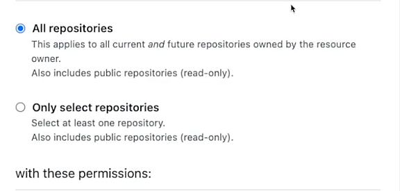

# 배포
[Create React App 에서 제공하는 배포 가이드](https://create-react-app.dev/docs/deployment)  
  
## Netlify
[Netlify 배포가이드](https://create-react-app.dev/docs/deployment#netlify)  
  
1. 내작업 환경에서 `Netlify`를 설치해서 수동적으로 배포하는 방법
   * ```
     npm install netlify-cli -g
     netlify deploy
     ``` 
2. Git 과 연동해서 자동적으로 배포하는 방법
   1. Netlify 에서 새로운 프로젝트 생성 
   2. Git과 연결

### 예제
Netlify 사이트에 가입한다음에 `Add new Site` 버튼을 클릭해 `important an exisiting project`를 클릭  
   

해당 페이지로 이동되는데 이때 `Github`를 클릭  
  
  
클릭후 우리의 gitbug와 연동한다음 배포할 git `repository`를 선택하면 된다.  

repository`를 선택한후 `Netlify`설치를 모든 `repository`에할 것인지 선택된 `repository` 할것인지를 선택해 주면된다.   
  

`Netlify`설치가 끝나면 `build`세팅과 어느 브랜치를 배포할 것인지 정할 수 있다.  
  
또한 Advanced build setting 을 통해서 환경 변수도 세팅할 수 있다.  

