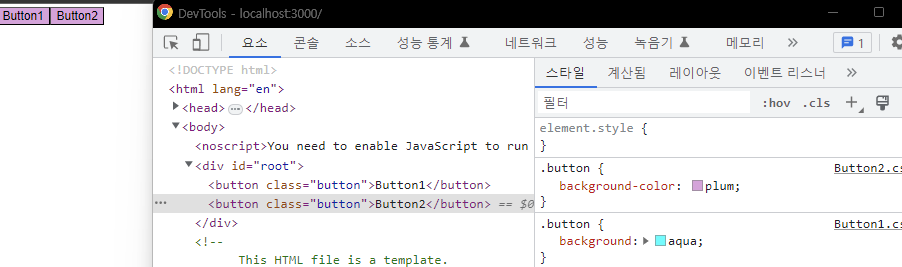
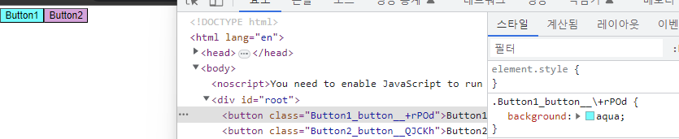
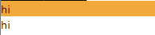
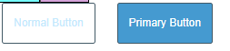

# React 에서 자주 사용하는 CSS 라이브러리

## PostCSS
우리가 일반적으로 사용하는 `CSS`를사용해서 `Component`를 만들어 보았다.
```
import React from 'react';
import './Button1.css'

.button {
    background: aqua;
}
function Button1(props) {
    return (
        <button className='button'>Button1</button>
    );
}

export default Button1;
```
```
import React from 'react';
import './Button2.css'
.button {
    background-color: plum;
}
function Button2(props) {
    return (
        <button className='button'>Button2</button>
    );
}

export default Button2;

```
이렇게 각각의 `Component`에 `CSS` 파일을 `import`하였다.  
각각의 버튼들은 다른 백그라운드 색갈을 가질까??  
  
결과는 위와 같다.  
`CSS`파일에서 동일한 `class`명을 가지면 나중에 선언된 `class`가 더 명시시도가 높기 떄문에  
뒤에 선언한 값을 덮어쓴다.  
그렇기에 일반 `CSS`파일을 사용할떄는 이름 충돌을 막기위해서 네이밍 규칭인 `BEM`을 사용해서 작성해야 한다.  
```
.button1-button {
    background: aqua;
}
.button2-.button {
    background-color: plum;
}
```
이런식으로 서로 다른 클래스명을 사용해야한다.  
  
근데 생각해보면 `Component`는 계속 계속 추가될 수 있고 그럴때마다 이런식으로 `CSS`를 만드는 것은  
상당히 비효율적이고 번거러운 작업이 된다.  
  
이러한 문제를 해결할 수 있는 것이 `PostCSS` 이다.  
`PostCSS`는  CSS 전처리기(preprocessor)로, CSS의 기능을 확장하고 개선할 수 있는 도구 이다.  

전처리기란  원래의 코드를 변경하여 더 나은 코드를 생성하는 프로그램이다.  
일반적으로 전처리기는 원래 코드를 읽고 처리하여 새로운 코드를 생성하는 작업을 수행한다.  
  
### 사용법
`CSS` 파일을 생성할때 파일확장자 이전에 `.module` 붙여서 생성해주면 된다.  
```
Button1.module.css
Button2.module.css
```
```
import React from 'react';
import styles from './Button1.module.css'

function Button1(props) {
    return (
        <button className={styles.button}>Button1</button>
    );
}

export default Button1;
```

  
  
이런식으로 `PostCSS`를 사용하면 외부의 이름충돌을 걱정하지 않고  
해당 `Component`에 `import`한 `class`이름을 작성하면  
`PostCSS` 에서 자동으로 클래스이름을 `.Button1_button__\+rPOd`이런식으로 고유한 `ID`값까지 붙여서  
클래스이름을 만들어준다.  
  
두개의 `CSS` 파일에서 동일한 이름의 클래스를 사용했지만
`CSS`를 파일별 모듈별로 관리를 해주기 때문에 이름 충돌을 걱정하지 않아도된다.  
또한 기존 `CSS`규칙을 그대로 따른 상태에서 관리해준다. 
  
## Styled Components
`Styled Components`는`Javascript`파일 안에서 `CSS`문법을 사용할 수 있는 라이브러리이다.  
[Styled Components 공식 홈페이지](https://styled-components.com/)  
  
```
const Button = styled.a`
  /* This renders the buttons above... Edit me! */
  display: inline-block;
  border-radius: 3px;
  padding: 0.5rem 0;
  margin: 0.5rem 1rem;
  width: 11rem;
  background: transparent;
  color: white;
  border: 2px solid white;

  /* The GitHub button is a primary button
   * edit this to target it specifically! */
  ${props => props.$primary && css`
    background: white;
    color: black;
  `}
`
```  
공식 홈페이지 예제에서 볼 수 있듯이 `Javascript`파일안에서 CSS 문법을 사용한다.  
먼저 `Button`은 스타일 컴포넌트이고 `a` 태그이다.  
또한 `props` 를 통해서 특정 값일 때 다른 `CSS` 도 적용할 수 있다.  
### 추가하는 방법
```
yarn add styled-components
```
만약 추가한후에  
```
ERROR in ./.yarn/__virtual__/styled-components-virtual-fbc3a878cb/0/cache/styled-components-npm-5.3.9-4d660d9c99-404311cc70.zip/node_modules/styled-components/dist/styled-components.browser.esm.js 1:0-80
```
이러한 에러가 발생하면 추가적으로 수동으로 `react-is`를 추가해준다.  
```
yarn add react-is
```
  
### 예시
스타일은 `` 안에 `CSS`문법을 작성해주면 된다.  
```
const Container = styled.div`
    display:flex;
    flex-direction:column;
`;
```
  
  
```
const Button = styled.button`
  background: transparent;
  border-radius: 3px;
  border: 2px solid #3c5b69;
  color: #b9eaff;
  margin: 0 1em;
  padding: 0.25em 1em;
  height:50px;
  ${(props) =>
    props.primary &&
    css`
      background: #009cd5;
      color: white;
    `};
`;
```
  
  
## TailWind
`Tailwind CSS`는 CSS 프레임워크로, CSS 코드를 작성하는 데 사용되는 많은 클래스(class)를 미리 정의하여 개발자가 코드를 작성하는 데 편리함을 제공한다.  
[tailwindcss 공식홈페이지](https://tailwindcss.com/)  
기존의 CSS 프레임워크와 달리, `Tailwind CSS`는 클래스 이름에 따라 CSS 스타일이 적용되므로,  
`CSS` 코드를 작성하는 데 있어서 다소 생산적인 방법을 제공한다.  
  
### 설치
```
yarn add -D tailwindcss
npx tailwindcss init
```  
tailwind.config.js 파일에 컨텐트 타입추가
```
/** @type {import('tailwindcss').Config} */
module.exports = {
  content: ["./src/**/*.{html,js,jsx,ts,tsx}"],
  theme: {
    extend: {},
  },
  plugins: [],
}
```

CSS 파일 상단에 해당코드 추가
```
@tailwind base;
@tailwind components;
@tailwind utilities;
```
  
### 사용예시
```

export default function TailwindComponent(props) {
    return (
        <div>
            <h1 className='text-8xl'>안녕!</h1>
            <button className='bg-blue-500 rounded-xl px-2'>Button</button>
        </div>
    );
}
```
   