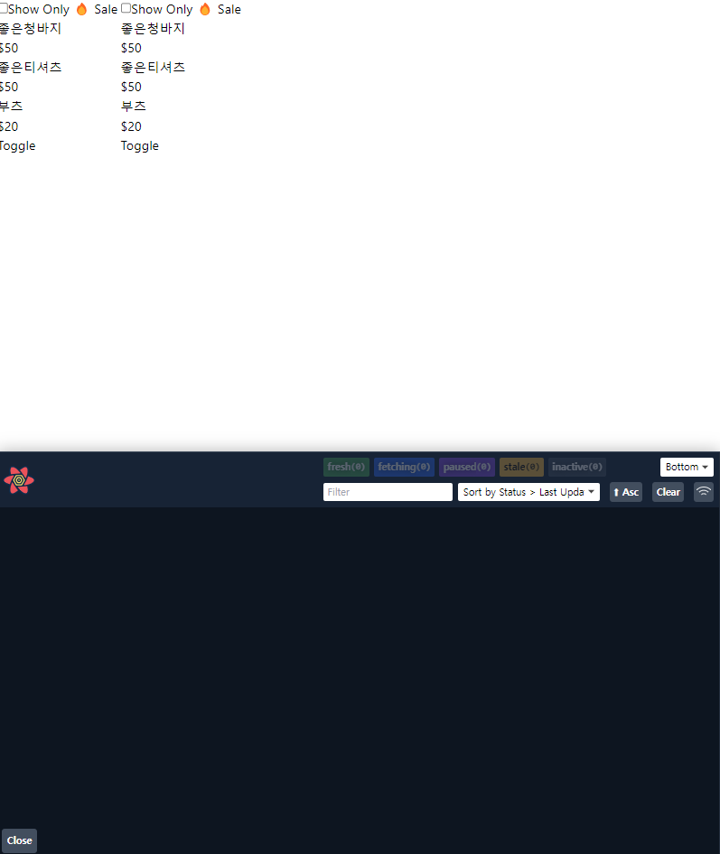
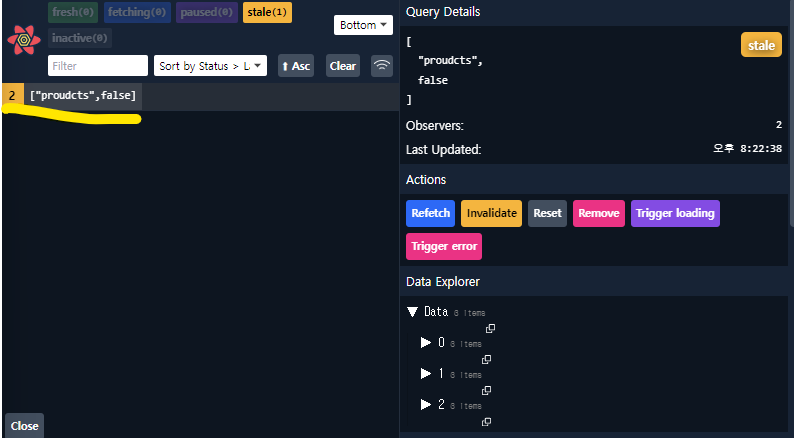
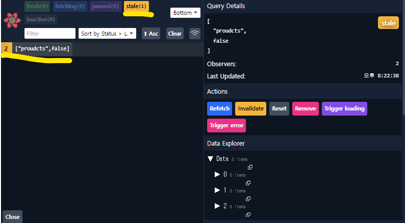
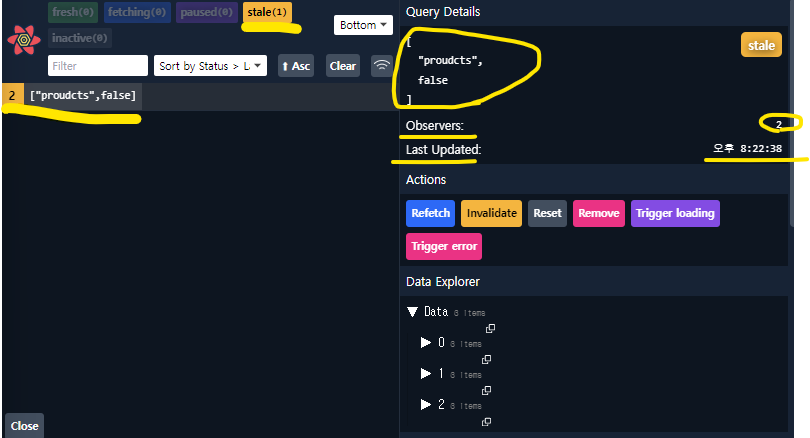
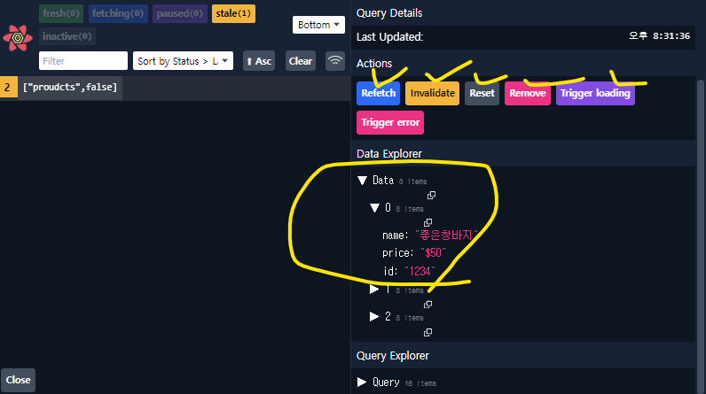
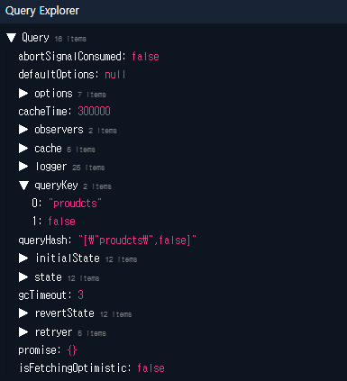

# React Query(TanStack Query)  
  
## 커스텀훅의 문제점
`React Hooks` 또는 `Custom Hooks`,(함수들은) 어떤 값의 재사용이 아니라 `로직`의 재사용을 위한 것이다.  
만약 완전히 동일한 `Custom Hooks`을 서로 다른 `Component`에서 호출하면 동일한 값을, 상태를 가진다.  
이 `Custom Hooks`은 어떤 상태를 만들지 즉, 어떤 로직을 이용해서 어떤 데이터를 반환해 줄 것인지만 결정될뿐  
`Custom Hooks`은 상태를 `global`하게 재사용할 수 있게 해주는 로직은 없다.  
  

### 정리
1. `Custom Hooks`은 `cache`가 되지 않는다.
   * `Custom Hooks`에서 데이터를 받아오는 통신 로직이 있다면 `Hook`을 호출할때마다 새롭게 데이터를 받아올 것이다.
2. 네트워크 통신에 실패 했을때 `retry` 기능을 구현하는데 번거롭다.
  
## 공식 사이트
[React Query TanStack Query 공식사이트](https://tanstack.com/query/v3/)  

`TanStack Query`는 `React Query`와 유사한 데이터 관리 라이브러이다.  
`TanStack Query는` 클라이언트 측에서 데이터를 쉽게 가져오고 관리할 수 있도록 도와주는데 이 라이브러리는 React Query와 달리 React에 의존하지 않아 다른 프레임워크에서도 사용할 수 있습니다.  
`TanStack Query`는 API 클라이언트를 자동으로 생성하여 API 요청과 응답을 관리한다. 이를 통해 개발자는 데이터 요청과 관리에 집중할 수 있다.  
또한 `TanStack Query`는 쿼리 캐싱과 인터셉터(Interceptor)를 지원하여 데이터를 효율적으로 캐시하고 필요한 경우에만 서버로 요청을 보내어 데이터를 가져올 수 있고    
이를 통해 불필요한 요청을 줄이고 애플리케이션의 성능을 향상시킬 수 있다.  

### 소개
Powerful asynchronous state management for TS/JS, React, Solid, Vue and Svelte  
강력한 비동기 상태 관리 라이브러리  
Toss out that granular state management, manual refetching and endless bowls of async-spaghetti code.  
상태관리, 수동적인 retetching, 비동기적인 스파게티 코드들은 전부 우리한테 맡겨라  
TanStack Query gives you declarative, always-up-to-date auto-managed queries and mutations that directly improve both your developer and user experiences.  
`TanStack Query`는 개발자와 사용자들에게 직접 선언적이고 최신의 자동 관리 쿼리 및 `mutation`을 제공한다.  
  
### 핵심 키워드
1. DECLARATIVE & AUTOMATIC
   * 데이터를 어디서 가져올지 얼마나 그 데이터를 유지하고 다시 데이터를 호출하는 것들을 자동으로 관리해준다.
   * 캐싱,  오래된 데이터를 백그라운드에서 업데이트를 어떠한 설정없이 자동으로 처리한다.
2. SIMPLE & FAMILIAR
   * `Promise` 와 `async/await`를 사용할줄 안다면 쉽게 사용할 수 있다.
   * `global 상태관리`, `reducers`, `복잡한 설정이`필요없다, 
3. EXTENSIBLE
   * 네트워크 요청별로 상세 설정을 할 수 있다.
   * `계발툴`, `무제한 로딩 APIs`, `상태 업데이트 툴등`을 제공해준다.  
### 제공 기능

  
  
## 설치
```
$ npm i @tanstack/react-query
# or
$ pnpm add @tanstack/react-query
# or
$ yarn add @tanstack/react-query
```
  
## 사용 예제
```
import React from 'react';
import './App.css';
import MainProducts from './query/components/MainProducts';
import {
    QueryClient,
    QueryClientProvider,
} from '@tanstack/react-query'

const queryClient = new QueryClient()

export default function App() {
    return (
        <QueryClientProvider client={queryClient}>
            <MainProducts/>;
        </QueryClientProvider>
    );
}

```
### useQuery
```
export default function Products() {
  const [checked, setChecked] = useState(false);
    const { isLoading, error, data:products } = useQuery(
        ['proudcts',checked],
        async () => {
            console.log('fetching..');
            return fetch(`data/${checked ? 'sale_':''}products.json`)
                .then((res) => res.json());
        
    });
  if (isLoading) return <p>Loading...</p>;

  if (error) return <p>{error}</p>;

```

[useQuery() 사용법](https://tanstack.com/query/v4/docs/react/reference/useQuery)
```
const {
  data,
  dataUpdatedAt,
  error,
  errorUpdatedAt,
  failureCount,
  failureReason,
  isError,
  isFetched,
  isFetchedAfterMount,
  isFetching,
  isPaused,
  isLoading,
  isLoadingError,
  isPlaceholderData,
  isPreviousData,
  isRefetchError,
  isRefetching,
  isInitialLoading,
  isStale,
  isSuccess,
  refetch,
  remove,
  status,
  fetchStatus,
} = useQuery({
  queryKey,
  queryFn,
  cacheTime,
  enabled,
  networkMode,
  initialData,
  initialDataUpdatedAt,
  keepPreviousData,
  meta,
  notifyOnChangeProps,
  onError,
  onSettled,
  onSuccess,
  placeholderData,
  queryKeyHashFn,
  refetchInterval,
  refetchIntervalInBackground,
  refetchOnMount,
  refetchOnReconnect,
  refetchOnWindowFocus,
  retry,
  retryOnMount,
  retryDelay,
  select,
  staleTime,
  structuralSharing,
  suspense,
  useErrorBoundary,
})
```

## Query Keys
`TanStack Query`는 기본적으로 `query keys`에 의해 데이터 캐싱을 관리한다.  
따라서 캐싱을 적절하게 잘 사용하려면 `query keys`를 잘 사용해야 한다.  
예를 들어 `A`라는 키를 사용하는 요청에는 동이한 캐시를 사용하고 `B`라는 네트워크 요청에는 `B`키에 해당하는 캐싱을 사용한다.  
그래서 이 `query keys`들을 잘 명시하고 분리하는 것이 중요하다.  
  
그러면 왜 문자열이 아니고 배열로 관리할까??  
그 이유는 좀더 detail 하게 키들의 조합을 만들어 나갈 수 있기 때문이다.  
```
// A list of todos
useQuery({ queryKey: ['todos'], ... })

// Something else, whatever!
useQuery({ queryKey: ['something', 'special'], ... })
```
위의 예제처럼 서로 다른 고유한 키를 사용면 이 두키는 명백히 서로 다른키 이기때문에 두키의 조합은 기존 캐시와 다른 캐시를 사용한다.  

```
// An individual todo
useQuery({ queryKey: ['todo', 5], ... })

// An individual todo in a "preview" format
useQuery({ queryKey: ['todo', 5, { preview: true }], ...})

// A list of todos that are "done"
useQuery({ queryKey: ['todos', { type: 'done' }], ... })
```
위처럼 동일한 데이터 키 `todo`이지만 두번째 키의 상태에 따라 다른 캐시를 사용할 수 있다.  
  
```
import React, { useState } from 'react';
import { useQuery, } from '@tanstack/react-query'

export default function Products() {
  const [checked, setChecked] = useState(false);
    const { isLoading, error, data:products } = useQuery({
        queryKey:['proudcts',checked],
        queryFn : async () => {
            console.log('fetching..');
            return fetch(`data/${checked ? 'sale_':''}products.json`)
                .then((res) => res.json());
        },
    });

```

## 정리
`Reac Query`를 사요할때는 `useQuery`라는 훅을 이용한다.  
이 훅을 사용할떄는 기본적으로 두가지 인자를 전달해준다.  
1. 캐시를 위한 `Query kes`를 배열 형태로 전달
2. 함수 -> 네트워크에서 데이터를 받아오는 로직을 함수형태로 전달,즉 네트워크를 통해 받아온 데이터를 `async await`을 통해 값을 바로 반환 하던지 아니면 `Promise`형태로 값을 `return`
3. 기타 옵션


## 우리의 문제점 확인
이렇게 `query keys`를 이용하면 모든게 완벽한 것일까??  
이렇게 소스코드르 변경한후 다른윈도우 창에 갔다가 다시돌아오면 `fetching`을 다시 호출하는 것을 확인할 수 있고  
두번째 `query keys`로 전달한 `checked`값이 변할때마다 데이터는 변하지 않았음에도 불구하고 캐싱데이터를 사용하는 것이 아니라 `fetching`을 다시 호출하는 것을 확인할 수 있다.  
왜 이런현상이 발생하는 것일까??

## DevTools 설치
```
$ npm i @tanstack/react-query-devtools
# or
$ pnpm add @tanstack/react-query-devtools
# or
$ yarn add @tanstack/react-query-devtools
```
개발툴을 `import`하고 
```
import { ReactQueryDevtools } from '@tanstack/react-query-devtools'
```

어플리케이션의 마지막에 `<ReactQueryDevtools initialIsOpen={false} />` 컴포넌트를 추가하면 된다.
```
function App() {
  return (
    <QueryClientProvider client={queryClient}>
      {/* The rest of your application */}
      <ReactQueryDevtools initialIsOpen={true} />
    </QueryClientProvider>
  )
}
```
이렇게 개발툴이 추가된 것을 확인할 수 있다.



  
해당 밑줄의 의미는 지금 `['products',false]` 키조합은 총 2개의 컴포넌트에서 데이터를 가진하고 있다는 의미이다.  
그리고 해당 색이 노란색 `stale`을 나타나고 이는 데이터가 조금 오래된 데이터를 의미한다.  
즉. 캐시가 된긴 되었는데 데이터가 조금 오래되었다는 의미이다.
  
  

또한 옆쪽에 좀더 상세하게 `Query Details`를 통해 `query keys`의 값이 무엇이 있는지  
`Observers`로 즉 관찰하고 있는 컴포넌트는 몇개인지 `Last Updated`를 통해 언제 마지막으로 업데이트 되었는지를 알 수 있다.  
  
  
그리고 개발툴을 통해서 수동적으로 `Refetch`, `Invalidate(데이터를 다시 검증)` `reset`, `remove`등 다양하게 수동으로 조작할 수 있고  
가장 밑 `Data`화면을 통해 실제 받아온 데이터들의 값을 확인할 수 있다.  
  
그리고 데이터 밑에 `Query Explorer`을 통해서 `Query`의 다양한 옵션 사항들을 확인할 수 있다.  
  
  
## 문제 확인
우리가 새롭게 `fetch`해서 데이터를 가지고 왔는데도 불구하고 개발툴에서 확인해보니  
이 모든 데이터의 상태가 `state`(오래된 데이터)이기 때문에 계속 계속 새롭게 데이터를 받아오는 것을 확인할 수 있다.
  
## 필수 숙지사항
[important defaults](https://tanstack.com/query/v4/docs/react/guides/important-defaults)  
위의 기본 숙지 사항에서 `React Query`는 공격적인 기능과 더불어 안전한 기본값으로 구성되어 있지만  
때때로 이러한 기본값들 때문에 새로운 사용자들이 배우는데, 혹은 디버깅하는데 많은 어려움을 느끼고 있다.  
그래서 `React Query`를 사용함에 있어 해당 부분은 꼭 숙지하고 사용하길 권장한다.  
  
* Query 객체는 `useQuery` 혹은 `useInfiniteQuery`를 통해 생성되는데 이때 쿼리 객체의 캐시된 데이터의 상태는 `stale(오래된 데이터)`로 간주된다.
> 그래서 이러한 기본적인 상태를 변경하기 위해서는 쿼리를 전역적으로 설정하거나 쿼리별로 `staleTime`이라는 옵션을 설정해주면 된다.  

* 그래서 기본적으로 `Stale`상태의 쿼리는 자동적으로 `background`에서 `refetch`가 된다.
  * 새로운 쿼리가 `mount`되었을때 (생성되었을때)
  * 윈도우 창이 다시 `focused` 되었을때
  * 네트워크가 다시 연결 되었을때
  * 쿼리가 `refetch interval` 옵션이 설정 되었을때

  
따라서 사용자가 예상하지 못한 `refetch`상황을 마주한다면, 대부분 윈도우가 다시 `focus`되어서 `React Query`가 `refetchOnWindowFocus(기본값)`작업을 수행하기 때문일 것이다.  
그래서 개발하는 단계에서 조금더 자주 발생하는 것을 볼수 있을텐데 그이유는 브라우저 개발툴과 앱을 전환화는 과정도 전부 `refocus`로 해석하기 때문이다.  
  
> 그래서 이러한 기본적인 해동들을 변경하기 위한 옵션으로는 `refetchOnMount(component mount시 refetch)`, `refetchOnWindowFocus`, `refetchOnReconnect `, `refetchInterval` 해당 옵션들의 설정을 끄면 `refetch`를 줄일 수 있다.
  
* 또한 `useQuery` 나 `useInfiniteQuery`를 사용하는 곳이 없다면 `inactive`상태로 표기가 된다.
* `inactive`상태가 5분이 지나면 자동적으로 `garbage collect`가 된다.
> 위의 설정을 변경하려면 `cacheTime`설정을 변경하면 된다.(밀리 세컨드 단위)
  
* `React Query`는 네트워크 통신에 실패하게 된다면 재시도를 3회 실행한다. 재시도를 실행할때마다 조금씩 대기시간을 길게해서 재시도를 한다.
> 위의 옵션도 `retry`와 `retryDelay` 옵션을 통해서 조정할 수 있다.
  
## 해결