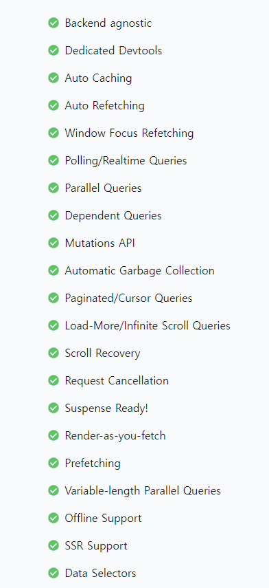

# React Query(TanStack Query)  
  
## 커스텀훅의 문제점
`React Hooks` 또는 `Custom Hooks`,(함수들은) 어떤 값의 재사용이 아니라 `로직`의 재사용을 위한 것이다.  
만약 완전히 동일한 `Custom Hooks`을 서로 다른 `Component`에서 호출하면 동일한 값을, 상태를 가진다.  
이 `Custom Hooks`은 어떤 상태를 만들지 즉, 어떤 로직을 이용해서 어떤 데이터를 반환해 줄 것인지만 결정될뿐  
`Custom Hooks`은 상태를 `global`하게 재사용할 수 있게 해주는 로직은 없다.  
  

### 정리
1. `Custom Hooks`은 `cache`가 되지 않는다.
   * `Custom Hooks`에서 데이터를 받아오는 통신 로직이 있다면 `Hook`을 호출할때마다 새롭게 데이터를 받아올 것이다.
2. 네트워크 통신에 실패 했을때 `retry` 기능을 구현하는데 번거롭다.
  
## 공식 사이트
[React Query TanStack Query 공식사이트](https://tanstack.com/query/v3/)  

`TanStack Query`는 `React Query`와 유사한 데이터 관리 라이브러이다.  
`TanStack Query는` 클라이언트 측에서 데이터를 쉽게 가져오고 관리할 수 있도록 도와주는데 이 라이브러리는 React Query와 달리 React에 의존하지 않아 다른 프레임워크에서도 사용할 수 있습니다.  
`TanStack Query`는 API 클라이언트를 자동으로 생성하여 API 요청과 응답을 관리한다. 이를 통해 개발자는 데이터 요청과 관리에 집중할 수 있다.  
또한 `TanStack Query`는 쿼리 캐싱과 인터셉터(Interceptor)를 지원하여 데이터를 효율적으로 캐시하고 필요한 경우에만 서버로 요청을 보내어 데이터를 가져올 수 있고    
이를 통해 불필요한 요청을 줄이고 애플리케이션의 성능을 향상시킬 수 있다.  

### 소개
Powerful asynchronous state management for TS/JS, React, Solid, Vue and Svelte  
강력한 비동기 상태 관리 라이브러리  
Toss out that granular state management, manual refetching and endless bowls of async-spaghetti code.  
상태관리, 수동적인 retetching, 비동기적인 스파게티 코드들은 전부 우리한테 맡겨라  
TanStack Query gives you declarative, always-up-to-date auto-managed queries and mutations that directly improve both your developer and user experiences.  
`TanStack Query`는 개발자와 사용자들에게 직접 선언적이고 최신의 자동 관리 쿼리 및 `mutation`을 제공한다.  
  
### 핵심 키워드
1. DECLARATIVE & AUTOMATIC
   * 데이터를 어디서 가져올지 얼마나 그 데이터를 유지하고 다시 데이터를 호출하는 것들을 자동으로 관리해준다.
   * 캐싱,  오래된 데이터를 백그라운드에서 업데이트를 어떠한 설정없이 자동으로 처리한다.
2. SIMPLE & FAMILIAR
   * `Promise` 와 `async/await`를 사용할줄 안다면 쉽게 사용할 수 있다.
   * `global 상태관리`, `reducers`, `복잡한 설정이`필요없다, 
3. EXTENSIBLE
   * 네트워크 요청별로 상세 설정을 할 수 있다.
   * `계발툴`, `무제한 로딩 APIs`, `상태 업데이트 툴등`을 제공해준다.  
### 제공 기능

  
  
## 설치
```
$ npm i @tanstack/react-query
# or
$ pnpm add @tanstack/react-query
# or
$ yarn add @tanstack/react-query
```
  
## 사용 예제
```
import React from 'react';
import './App.css';
import MainProducts from './query/components/MainProducts';
import {
    QueryClient,
    QueryClientProvider,
} from '@tanstack/react-query'

const queryClient = new QueryClient()

export default function App() {
    return (
        <QueryClientProvider client={queryClient}>
            <MainProducts/>;
        </QueryClientProvider>
    );
}

```
### useQuery
```
import React, { useState } from 'react';
import { useQuery, } from '@tanstack/react-query'

export default function Products() {
  const [checked, setChecked] = useState(false);
    const { isLoading, error, data:products } = useQuery({
        queryKey:['proudcts'],
        queryFn : async () => {
            console.log('fetching..');
            return fetch(`data/products.json`)
                .then((res) => res.json());
        },
    });
  // const [loading, error, products] = useProducts({ salesOnly: checked });
  const handleChange = () => setChecked((prev) => !prev);

  if (isLoading) return <p>Loading...</p>;

  if (error) return <p>{error}</p>;

  return (
    <>
      <label>
        <input type='checkbox' checked={checked} onChange={handleChange} />
        Show Only 🔥 Sale
      </label>
      <ul>
        {products.map((product) => (
          <li key={product.id}>
            <article>
              <h3>{product.name}</h3>
              <p>{product.price}</p>
            </article>
          </li>
        ))}
      </ul>
    </>
  );
}

```

[useQuery() 사용법](https://tanstack.com/query/v4/docs/react/reference/useQuery)
```
const {
  data,
  dataUpdatedAt,
  error,
  errorUpdatedAt,
  failureCount,
  failureReason,
  isError,
  isFetched,
  isFetchedAfterMount,
  isFetching,
  isPaused,
  isLoading,
  isLoadingError,
  isPlaceholderData,
  isPreviousData,
  isRefetchError,
  isRefetching,
  isInitialLoading,
  isStale,
  isSuccess,
  refetch,
  remove,
  status,
  fetchStatus,
} = useQuery({
  queryKey,
  queryFn,
  cacheTime,
  enabled,
  networkMode,
  initialData,
  initialDataUpdatedAt,
  keepPreviousData,
  meta,
  notifyOnChangeProps,
  onError,
  onSettled,
  onSuccess,
  placeholderData,
  queryKeyHashFn,
  refetchInterval,
  refetchIntervalInBackground,
  refetchOnMount,
  refetchOnReconnect,
  refetchOnWindowFocus,
  retry,
  retryOnMount,
  retryDelay,
  select,
  staleTime,
  structuralSharing,
  suspense,
  useErrorBoundary,
})
```

