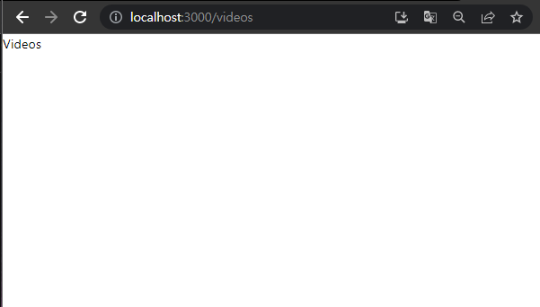
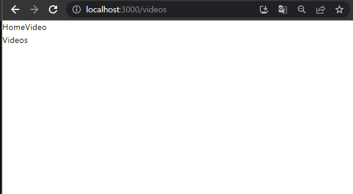
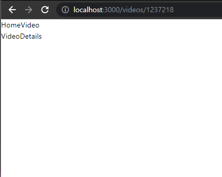
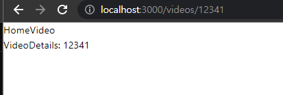

# React Router

## CSR에 대해 정리

### 라우팅(Routing) 이란?

네트워크에서 데이터 패킷을 출발지에서 목적지까지 전달하기 위해 경로를 결정하는 과정을 말합니다.  
즉, 우리가 브라우저 주소창에다가 `URL`를 입력했을때 서버에서 요청된 `URL`에 해당하는 데이터를 전달해 주는 것을 말한다.

### Client side Routing 이란

웹 애플리케이션에서 브라우저 측에서 라우팅을 처리하는 방식입니다.  
전통적인 서버 사이드 라우팅(Server-side Routing) 방식에서는 서버가 클라이언트의 요청에 대한 응답으로 HTML 페이지 전체를 다시 로드하고 렌더링한다.  
하지만 클라이언트 사이드 라우팅에서는 페이지 전체를 다시 로드하지 않고,  
필요한 데이터만 서버로부터 요청하여 받아와서 화면을 업데이트합니다.

클라이언트 사이드 라우팅은 브라우저의 JavaScript 엔진을 이용하여 동적으로 웹 페이지를 렌더링하며,  
이를 가능하게 하는 라이브러리나 프레임워크가 있다.(React,Angular, Vue)

즉, 페이지 전체를 유지하면서 원하는 부분만 네트워크 통신을 통해 업데이트 한다.  
그래서 `React Router`를 이용하면 `SPA`를 유지하면서 멀티페이지의 장점을 그대로 유지할 수 있다.

## 새로운 라이브러리를 공부하는 방법

어떤 라이브러리를 공부하던 먼저 공식사이트를 먼저 확인하는 습관이 중요하다.  
특히 `React Router`처럼 버전 업데이트가 빈번하게 발생하는 라이브러리라면 더더욱 공식사이트가 중요하다.

공식 사이트에서 먼저 확인해야 할것들은?

1. Homage 소개 페이지 -> 해당 라이브러리의 큰그림을 이해할 수 있다.
    1. 내가 사용할 라이브러리가 어떤 문제를 해결하기위해서 만들어진 것인지
    2. 해당 라이브러리의 장점은 무엇인지
    3. 어떤 상황에서 사용해야 하는 건지?
    4. 사용했을때의 이점은 무엇인지?
2. Getting started 페이지를 훑어보자 -> 빠르게 기능파악
    1. 설치방법
    2. 사용방법
    3. 사용예제
3. 프로젝트 -> 실전 프로젝트를 통해 사용법 숙지
    1. 사용 예제
    2. 공식 문서 확인

## 사용 예제

설치

```
yarn add react-router-dom
```

```
import React from 'react';
import {createBrowserRouter,RouterProvider} from 'react-router-dom';

const router = createBrowserRouter([{
    path:'/',
    element: <p>Home</p>,
    errorElement:<p>Not Found</p>
},{
    path:'/videos',
    element: <p>Videos</p>
}


])

export default function App(props) {
    return (
        <RouterProvider router={router}/>

    );
}

```

## 실습 outlet

라우팅에 필요한 컴포넌트들은 보통 `pages`라는 디렉토리를 추가해서 관리한다.  
우리가 화면 전체를 바꾸는 것이 아니라 네비게이션 바를 만들고 클릭했을때 해당 부분만 변경하고 싶을때는  
`React Router` 에서 제공하는 `outlet`을 사용하면 된다

먼저 우리는 `Root` 라는 컴포넌트 안에 우리가 라우팅할 페이지 값을 설정할 것이다.

```
import React from 'react';
import {Outlet} from 'react-router-dom';

function Root(props) {
    return (
        <div>
            <Outlet/>
        </div>
    );
}

export default Root;
```

또한 네비게이션 컴포넌트를 만들어서 해등 메뉴를 클릭하면 그화면으로 라우팅 되게 설정해보자

```
import React from 'react';
import {Link} from 'react-router-dom';

function NavBar(props) {
    return (
        <nav>
            <Link to='/'>Home</Link>
            <Link to='/videos'>Video</Link>
        </nav>
    );
}

export default NavBar;
```

이때 `React Router` 에서 제공해주는 `<Link/>`라는 컴포넌트를 이용할 것인데  
이는 `a` 태그와 유사하다. 차이점은 해당 페이지에서 라우팅을 가능하게 해준다.  
그후에 `Root`에 우리가 추가한 `NavBar` 컴포넌트를 추가한다.

```
import React from 'react';
import {Outlet} from 'react-router-dom';
import NavBar from "../components/NavBar";

function Root(props) {
    return (
        <div>
            <NavBar/>
            <Outlet/>
        </div>
    );
}

export default Root;
```  

그다음에 `App.jsx`에가서 `Root`를 추가한다.

```
import React from 'react';
import {createBrowserRouter, RouterProvider} from 'react-router-dom';
import NotFound from "./pages/NotFound";
import Videos from "./pages/Videos";
import Root from "./pages/Root";

const router = createBrowserRouter([{
    path: '/',
    element: <Root/>,
    errorElement: <NotFound/>
}, {
    path: '/videos',
    element: <Videos/>
}
])

export default function App(props) {
    return (
        <RouterProvider router={router}/>

    );
}

```

그다음 우리가 추가한 네바를 클릭하면 어떻게 될까??

  
우리가 예상한 결과는 우리가 추가한 Navbar 바로 밑에 컨텐츠가 나오기를 바란다.  
즉 `Outlet` 컴포넌트가 있는 위치에 우리의 컴포넌트가 보이고 `navBar`는 그대로 유지되기를 바란다.  
그럴때는 `router`의 경로를 외부에 작성하는 것이 아니라 `Root` 컴포넌트의 자식으로 지정해 줘야한다.

```
const router = createBrowserRouter([{
    path: '/',
    element: <Root/>,
    errorElement: <NotFound/>,
    children: [
        {
            index: true, element: <Home/>
        },
        {
            path: '/videos',
            element: <Videos/>
        },
    ]
},
])
```

  
이제야 우리가 원하는 결과대로 작동하는 것을 확인할 수 있다.

## 파람 사용하기(상세페이지 만들기)

* /home -> Home 컴포넌트를 보여준다.
* /videos -> videos 컴포넌트를 보여준다.
* /videos/id -> videos 상세 페이지를 보여준다.⭐

```
const router = createBrowserRouter([{
    path: '/',
    element: <Root/>,
    errorElement: <NotFound/>,
    children: [
        {
            index: true, element: <Home/>
        },
        {
            path: '/videos',
            element: <Videos/>
        }, {
            path: '/videos/:videoId',
            element: <VideoDetail/>
        },
    ]
},
])
```  
경로에 `:`붙여서 어떠한 ID가 오던 그 해당 ID의 상세 페이지를 보여주기 위해서이다.  
한번 잘 작동하는지 확인해보자.  
  
어떠한 ID를 입력하던 일단 `VideoDetail` 컴포넌트로 이동하는 것을 확인할 수 있다.  
  
여기서 더 나아가서 `Video`컴포넌트에 있는 ID를 클릭했을데 상세페이지로 이동하게 변경해보자.  
즉, 상세페이지를 클릭했을때 `URI`를 변경해서 `VideoDetail` 컴퍼넌트로 라우팅 하자.  
  
`React Router`에서 특정 경로로 이동할 수 있는 방법은 두가지가 있다.  
1. `<Link/>` 태그를 이용해서 사용자가 클릭하면 `to` `attribute`에 할당된 경로로 이동하는 방법이 있다.
2. 코드상에서 동적으로 이동하고 싶다면 `useNavigate()`를 사용하면 된다.  
  
### useNavigate()
```
    const [text, setText] = useState('');
    const navviage = useNavigate()
    const handleChange = (e) => {
        setText(e.currentTarget.value);
    };
    const onSubmit = (e) => {
        e.preventDefault();
        setText('');
        navviage(`/videos/${text}`); // 경로를 파라미터로 넘김
    };

```    

이렇게 `useNavigate`를 이용해서 원하는 경로 이동하면서 URL 파라미터 값을 가져오는 방법은 무엇일까??  
`useParams()`파람을 이용하면 쉽게 얻을 수있다.  
이때 키값은 우리가 앞에서 설정했던 ` path: '/videos/:videoId'` 경로의 `:videoId`가 키값이다.
  
```
const {videoId} = useParams();
```
```
import React from 'react';
import {useParams} from 'react-router-dom';
function VideoDetail(props) {
    const {videoId} = useParams();
    return (
        <div>VideoDetails: {videoId}</div>
    );
}

export default VideoDetail;
```  
  
