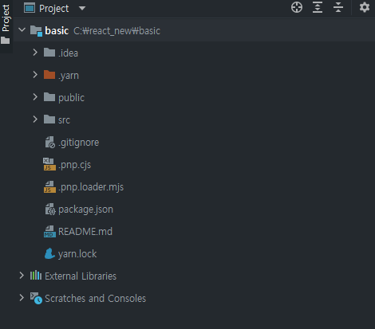
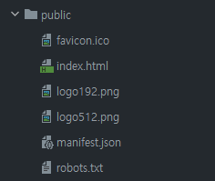
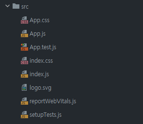
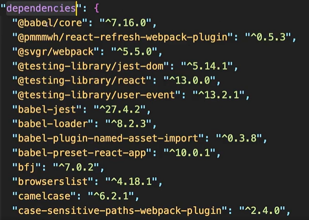
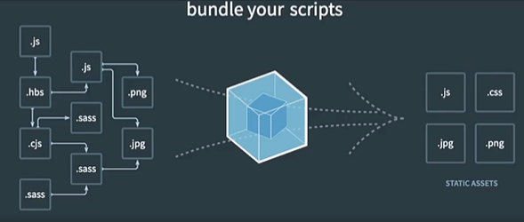

## React(Components 들로 이루어진 UI 라이브러리)


### What's React??
A JavaScript library for building user interface!!  
**user interface**를 만들기 위한 자바스크립트 라이브러리 입니다.  
2013 년쯤 facebook 에서 어떻게 하면 UI를 빠르게 만들고 어떻게 하면 사용자의 이벤트에 즉각적으로 반응해서 UI를 업데이트 할 수 있을까??  
어떻게 하면 간편하게 application을 만들 수 있을까?? 라는 고민을 거듭해서 탄생한게 React 의 시초이다.

* 2013년도 3월 Open소스 공개
* 2015년  5월 React Native (React를 이용해서 모바일을 만들어보자)
* 2019년  2월 함수형 컴포넌트(React Hooks)
* 2022년  3월 SSR+ (성능 개선 뿐만아니라 서버사이드 렌더링을 위한 컴포넌트도 추가)

`즉, React는 웹, 모바일 앱을 손쉽게 만들수 있게 해주고 심플한 정적 사이트 부터 복잡한 규모까지 모두 수용할 수 있다.`  
React를 통해 웹 applicatoin, React Native 를 통해 Mobile applicatoin, React+ Electron 을 톹해 Desktop application을 만들 수 있다.

#### 간단한 용어 정리
* SPA (Single Page Application)
* CSR (Client Side Rendering)
    * 사용자가 우리 웹 Application에 접속했을때 바로 즉각적으로 HTML을 보는 것이 아니라 우리가 작성한 JavaScript 뿐만 아니라  
      React의 라이브러리도 같이 다운로드 받은 후에 사용자 화면에 UI가 표기되기 떄문에 Client 측에서 Rendering이 이루어 진다.
    * React와 함께 Next.Js 와 Gatsby 같은 프레임워크를 사용하면 SSR(Server Side Rendering)도 구현 가능하다.

### Framework 와 library 의 차이  
통상적으로 FrameWorks 라고 하면 우리가 무언가를 만드는데 필요한 모든 것들이 갖춰지고 제공되어지는 것이라고 생각하면 된다.  
만약 Web FrameWorks 라고 하면 UI, Routing, HTTP Clients(네트워크 통신), State management(대용량 데이터 처리) 등 과 같이 이 모든 것들이  
포함되어져 있는 것을 말한다.  
즉, 집을 짓는데 필요한 모든 골격이 전부 갖춰졌다고 생각하면 된다.(정해진 틀이 있고 그안에서 원하는 것을 만들어 나간다.)  
이렇게 모든 것들이 갖춰져있는 Frameworks의 대표가 Angular, 안드로이드, IOS 등이 있다.  
  
반면에 Libraries 는 이렇게 골격이 갖추어지지 않았고 UI, Routing, HTTP Clients(네트워크 통신), State management(대용량 데이터 처리)와 같이  
작은 Solution 단위를 Library라고 한다.  
대표적으로 React는 많은 해결책중에서 UI를 만들 수 있게 해주는 라이브러리 이다.  
그러면 View는 어디에 속해있을까???  
View는 Angular 처럼 FrameWork 에 속하지만 HTTP Clients(네트워크 통신), State management(대용량 데이터 처리)가 제공되지 않기때문에  
조금더 경량형 FrameWork라고 보면 좋다.  
  
### React의 철학
* A JavaScript library for building user interface!
  * user interface --> Renders **UI** and Response to(react to) **events**
  * UI를 표기하고 보여주고 나서 이벤트에 반응하도록 만들어진 Library
* 즉 UI를 Component 단위로 보여주고 이벤트에 반응하도록 만들어진 Library 이다 

### Components
A highly `cohesive building block` for UIs.  
`loosely coupled` with other components  
다른 Component 들과 독립적이고 응집도가 정말 높은 UI 블럭  

`즉, 한가지 기능을 수행하는 UI 단위`   
`서로 독립적이며, 고립되어있고, 재사용이 가능하다.`

리엑트 어플리케이션은 하나의 컴포넌트로 이루어져있다.   
최상위에 존재하는 컴포넌트를 **Root**라고  한다.
<pre>
React
    Root
     |
     |
     ----->  Navbar (Component)     
     |          |
     |          |
     |          ----->  Logo(component)  
     |          |
     |          |
     |          -----> button(component) 
     |          |
     |          |
     |          -----> button(component) 
     ----->  Content (Component)
                |
                |
                ----->  Article(Component)

이렇게 독립적인 Component 들을 조합해서 만들어 놓은 것을 리액트 어플리케이션이라고 한다.
</pre>
이 리엑트의 Component 들도 DOM Tree 와 마찬가지로 Tree 형식으로 만들어져 있다.

--> 리엑트는 UI 만들 수 있는 라이브러리 이고, 이 리액트를 이용해서 웹어플리케이션을 만든다는 것은   
컴포넌트들을 만든다 라고 말할 수 도 있다.  
  
마치 레고의 블럭 처럼 하나 하나 독립적이고 조그만한 부품들이 모여 큰 부품이 되어가는 것이 유사하다.

### Component를 나누는 기준??
* 재사용성 
  * DRY(Don't Repeat Yourself): 반복하지말고 재사용가능한 로직은  재사용해야된다.
  * Component 를 만들때 `Click`,`Send`,`Submit`등과 같은 버튼을 자주 사용한다면 해당 버튼을 Component로 만들어서 재사용 하자.
* 단일책임
  * SR(Single Responsibility)
  * 만약 article Component 가 있고 그안에  들어 있는 요소들은 다른 웹페이지에서 재사용할 가능성이 낮더라도  
  Component 안에서 너무 많은 UI를 가지고 있거나 , 너무 많은 로직들이 들어있거나 , 너무 다양한 일들을 하게 된다면  
  이것들을 조금더 작은 단위로 한 UI에서는 하나의 역할을 담당해서 보여줄 수 있도록 만들 수도 있다.
  * 단, 이때 너무 작은 단위까지 Component 를 쪼개는 것이 아니라 한 Component가 너무 많은 로직, 정보를 보여주는 것을 방지하기 위함이다.
  * 즉, 한 Component 내에서 너무 많은 일들을 한다면 비록 해당 부분을 재사용하지 않더라도 해당 Component를 작은 단위로 하나의 책임을 가질수 있도록  
  더 작은 Component 로 분리해준다.


### 동작 원리
사용하는 곳
```
    <CounterButton name='myButton' />;
```  
  
컴포넌트 정의  
```
export function CouterButton(props){
    const [count,setCount] = useState(0);
    return (
        <div>
            <h1>Hello, {props.name}</h1>
            <button onClick={() => setCount((count) => count + 1)}>{count}</button>
        </div>
    );
}

```
  
이때 Component를 정의할때 함수형태로 정의할 수 있는데 이를 **함수형 컴포넌트**라고 한다.  
보통 함수는 소문자로 시작하는데 React **함수형 컴포넌트**라면 무조건 대문자로 시작해야된다.  
또한 함수형 Component는 HTML처럼 생긴 이 JSX 문법을 사용하는 것을 반환(return) 해줘야한다.  
```
    // render
    return (
        <div>
            <h1>Hello, {props.name}</h1>
            <button onClick={() => setCount((count) => count + 1)}>{count}</button>
        </div>
    );
```  
JSX(JavaScript XML): JavaScript 에서 함수 반환값으로 HTML 처럼 생긴것을 반환할 수 있는데 이것을 JSX라고한다.  
```
        <div>
            <h1>Hello, {props.name}</h1>
            <button onClick={() => setCount((count) => count + 1)}>{count}</button>
        </div>
        
```
  
이때 우리가 만든 Component 는 버튼을 클릭할때마다 숫자가 하나씩 증가하는데  
이때 Component 가 가지고 있는 데이터 , 즉 **상태**는 useState 함수를 이용하여 변수 형태로 저장한다.  
```
    const [count,setCount] = useState(0);
```  
  
이때 함수형 Component 의 인자 값으로 props(properties)는 외부에서 전달하는 값  
```
    <CounterButton name='myButton' />;
    // 해당 Component의 name 값은 props를 통해 해당 값에 접근할 수 있다.

```

  
  

### 형태(Class)
react 에서 제공하는 컴포넌트라는 클래스를 상속해야 된다.
<pre>
<code>
import React from 'react';

class Button extends Component{
    state = {
        numberOfLikes: 0
    };
    render(){
    return &lt;button&gt;
        {this.state.numberOfLikes}
    &lt;/button&gt;;
    }

}
</code>
</pre>
### 1.State
컴포넌트에 들어있는 데이터를 나타내는 오브젝트
### 2.render
render 함수는 사용자에게 어떻게 표기될 건지 JSX로 표기   
--> 데이터가 변경이 되면 이 render 함수가 자동적으로 다시 호출(변경된 State 값이 화면에 나타날 수 있게)

만약 최상위 컴퍼넌트인 Root 가 변경이되면 그 하위 자식요소의 render함수도 같이 호출된다.   
그러면 state 가 변깅이 될때 마다 모든 render함수가 다시 호출 되는건 서능에 안좋은게 아닐까??

### React의 이벤트
React 는 Component 들의 집하체 이다.  
이때 각각의 Component들은 그들의 상태값(Stat)를 가지고 있다.  
사용자가 데이터를 입력하거나 클릭했을때 우리는 이 Stat, 상태값을 Update하면 된다.  
그러면 React 에서 자동으로 이 상태값이 변경된 Component만 새롭게 Update 해준다.  
만약 상위 Component 가 변경되면 그 하위 Component들을 모두 새롭게 Update 한다.

### Virtual Dom Tree
브라우저의 DOM Tree 처럼 리액트도 리액트만의 Virtual Dom Tree 가 존재   
가상의 돔 트리로 메모리상에 보관이 되어져있다.   
그래서 컴포넌트에 변경이 생겨서 자식 컴퍼넌트의 render 함수가 호출이되면   
**previous tree** 와 (이전의 Virtual Dom Tree) 와 비교해서   
정말 실질적으로 어떤 부분이 업데이트 돼야 되는지 계산을 한다음에 정말 필요한 부분만   
Dom Tree 에 업데이트 를 한다   
그래서 render함수가 많이 호출되어도 실질적으로 보여지는 데이터가 변동되지 않으면   
DOM Tree 에는 영향을 주지 않는다.   
이때 매번 업데이트를 하는 것이 아니라 업데이트해야 되는 내용들을 모았다가   
한 번에 다같이 업데이트를 한다.
1. 컴포넌트 변경, render 함수 호출
2. 이전 Virtual Dom Tree 현재 Virtual Dom Tree 를 비교
3. 실질적으로 보여지는 화면에 데이터가 변동이 되면 DOM Tree 업데이트
   

### Re-render the whole app on every update  
1. 데이터를 State(내부상태), props(외부로 부텆 전달받은 상태)를 나타내는 render가 있다.  
2. 리엑트는 데이터가 변경이 될때마다 어플리케이션 전체를 다시 렌더링(re-render) 된다.   
3. 실제로 변경된 부분만 화면에 업데이트된다.  

그래서 state 에 맞게 render 함수가에서 어떻게 표기될 건지 한 번만 정리를 해 놓으면   
react 가 알아서 render함수를 호출 해준다.  

### React Hooks  
  
2019년도 이전 함수형 component가 나오기 전에는 class 형태로 component를 만들어 나갔다.  
```
class Likebutton extends Component{
    state = { likes : 0};
    
    render(){
        return <button>{this.state.likes}</button>
    }
}
```
  
  
클래스 컴포넌트의 단점  
* 클래스 자체에 대한 어려움
* this 바인딩 이슈
* 로직들을 재사용하기 어려움  
  
그래서 조금더 손쉽게 로직들을 재사용하면서 class를 사용하지않고 component를 만들 수 없을까 고민하면서 나온게  
함수형 컴포넌트이다.  
  
```
function LikeButton(props){
    const [likes,setLikes] = useState(0);
    return <button>{likes}</button>;
}
```
  
함수형 컴포넌트는  
* 함수로 컴포넌트를 만들 수 있다.
* class 나 상속을 몰라도 함수로 정의하고 return 으로 jsx를 return 하는 것만 만들어두면 조금더 쉽게 컴포넌트를 만들 수 있게 되었다.
* React Hooks 를통해 로직들을 재사용할 수 있게 되었다.

  
Hooks are functions that let you "hook into" React state and lifecycle feature from function component  
Hooks 는 React의 State와 라이프 사이클에 관련된 기능들을 갈고리처럼 연결할 수 있는 함수들 이다.  
즉 React 의 Hooks 는 재사용할 수 있는 함수다  
이런 재사용 가능한 Hooks 들은 `use`로 시작한다.  
또한 사용자가 직접 custom Hook 을 만들 수도 있다.  
```
    useState, useEffect, useRef, useMemo, usecallback, usecontext.....
```
  
이때 자주 사용한 Hooks 들은  
* useState  : 상태관리 로직
* useEffect : 컴포넌트 생애주기 관리 로직
* useUser   : 서버에서 받아온 사용자
  
#### 즉, Hooks은(함수들은) 값의 재사용이 아니라 **로직의 재사용**을 위한 것이다


### 필요한 Tool
1. 터미널   
   1.1 window: [cmder](https://cmder.net/)   
   1.2 mac: [iterm](https://iterm2.com/downloads.html) [iTerm 셋팅](https://gist.github.com/kevin-smets/8568070)
2. 노드: [NodeJS](https://nodejs.org/en/)
3. yarn : [yarn](https://classic.yarnpkg.com/en/docs/install/#windows-stable), npm install yarn --global
   1. [yarn installation](https://yarnpkg.com/getting-started/install)
   2. 노드 버전이 16.10 버전 보다 크다면 `corepack enable` 명령어를 실행해줘야한다
   3. 16.10 이전 버전이라면 `npm i -g corepack` corepack 을 설치 해준다.
   4. cmder 에서 실행하는경우 `corepack enable` EPERM: operation not permitted 에러가 발생할 수 있다.  
      이때 NodeJs Command Prompt를 관리자 권한으로 실행한후에 해당 명령어를 실행해주면 된다.
   5. `yarn set version stable` 명령어를 통해 yarn 버전을 업데이트한다.

#### NodeJs
JavaScript runtime environment(framework) that `executes JavaScript` code `outside a web browser`  
자바스크립트를 실행할 수 있게 해주는 JavaScript 실행환경   
예전에는 자바스크립트를 브라우저 위에서 동작하는 웹페이지나 웹 어플리케이션을 위해서 작성하는 언어였다.   
하지만 NodeJs 덕분에 웹브라우저 밖에서도, 즉 운영체제 위에서나 노드JS 환경이 있다면   
우리가 작성한 자바스크립트 코드를 실행할 수 있다.   
--> 어느 곳에서나 자바스크립트로 프로그래밍이 가능하게 하는 프레임 워크
  

#### npm
`Publish` and `share` course code of NodeJs packages simplify installation, updating, and uninstallation of packages  
npm 은 패키지 매니저이다.  
우리는 프로젝트를 만들때 우리의 코드 뿐만아니라 외부 dependency를 가지고 온다.  
이말은 외부 library를 사용한다는 의미인데 그 library를 쉽게 설치하고 버전을 관리해주는 것이 `npm`이다.  

`즉, 라이브러리, 패키지들 쉽게 관리할 수 있게 도와주는 것이 npm`   
npm을 이용하면 package.json 파일을 프로젝트 루트에 생성하고 이 package.json 안에 우리가 사용하고 있는   
외부 라이브러리들과 그들의 버전정보들이 들어 있다.   
--> 설치 및 업데이트 (실행할 수는 없음)

#### npx
만약 library 를 개별적으로 실행하고 싶다면 `npx`를 이용하면 된다.
이 `npx`는 `npm`이 설치 될때 함께 설치가 되고 `npm`이 라이브러리, 패키지를 관리한다면   
`npx`는 우리가 원하는 라이브러리를 개별적으로 실행할 수 있게 도와준다.   
ex) npx 원하는라이브러리 이름

#### yarn
built on top of npm to resolve some of npm's shortcomings  
faster, consistent, and secure  
  

`npm`을 대체할 수 있는 `yarn`은 페이스북에서 만든 패키지 매니저이다.  
`npm`과 `yarn`은 서로 호환이 되기때문에 서로 바꿔가면서 사용은 할 수 있지만 권장하지는 않는다.  
이 `yarn`은 `npm`의 단점을 커버하귀 위해서 만들어졌다.  
`npm`은 외부 라이브러리가 많으면 많을 수록 프로젝트를 실행하는 속도가 현저하게 떨어진다.  
그이유는 필요한 라이브러리를 하나 하나씩 순차적으로 실행하고 설치하기 때문이다.  

하지만, `yarn`은 라이브러리를 병렬적으로 동시에 설치하고 실행하기 때문에 `npm`에 비해 상대적으로 빠르고  
보완적인 측면에서도 `yarn`이 너 뛰어나다.(단 최신버전 npm은 이러한 단점들을 보완하고 있다.)  
즉, `yarn`은 `npm`에서 서능, 보안 등을 개선해서 만든 패키지 매니저이다   


#### 설치확인
1. node -v
2. npm -v
3. yarn -v
4. git --version

### 공식 사이트
[React 공식 사이트](https://reactjs.org/)   
[React 베타 문서](https://beta.reactjs.org/)   
[Create React App](https://create-react-app.dev/)  

### Create React App
<pre>
npx create-react-app my-app(프로젝트 이름)   
cd my-app   
npm start
</pre>
<pre>
npm init react-app my-app
</pre>
<pre>
yarn create react-app my-app
</pre>
<pre>
yarn start : 작성한 코드를 실행
yarn build : 실행 x, 배포 빌드
yarn test : 테스트 성공 여부 확인
yarn eject : React App을 이용해서 다운로드 받은 패키지들을 확인하고 수정할 수 있다.
</pre>

### React 포로젝트 구조
  
  
* .yarn : yarn을 실행하기 위해 필요한 것들이 모여있는 directory
* node_modules : npm을 통해 라이브러리를 다운로드 받으면 항상 그 라이브러리가 노드모듈 안에 설치가 된다.
  * 하지만 yarn을 이용하면 대부분 노드 모듈안에 들어있지 않을 것이다.
* `pnp`(Plug and Play): 그이유는 이제 `pnp`(Plug and Play)라는 것을 이용하기 때문이다.
  * 매번 프로젝트 마다 라이브러리를 다운받고 노드모듈 안에 파일을 만드는 것은 상대적으로 build 하고 실행하는데 속도가 오래 걸린다.
  * 왜냐하면 파일 입출력은 상당히 소모적인 일이기 때문이다.
  * 이를 해결하기 위해서 `yarn` 에서는 `pnp` 를 이용해서 프로젝트에 필요한 라이브러리와 버전정보, PC 어디에 설치되어져 있는지  
  어디서 다운로드 받으면 되는지 이러한 정보들이 들어있다.
  * 따라서 `pnp`는 외부 라이브러리를 설치할때 `yarn` 에서 내부적으로 필요한 파일들이다
* yarn.lock : 외부 라이브러리를 설치할때 `yarn` 에서 내부적으로 필요한 파일들이다


* public : static 한 리소스들이 해당 directory 에 들어간다.
  * favicon.io
  * index.html : React application 에서 유일하게 존재하는 HTML 파일
    * HTML 안에는 React application 에 필요한 HEAD 정보와 `<div id="root"></div>`가 존재한다.
  * 필요한 이미지 파일들, manifest.json 파일은 모두 PWA(progressive web app) 에 사용된다.
    * PWA : 인터넷 웹사이트의 파일들(html, javascript, css, images같은..)을 컴퓨터에 잘~ 저장(캐싱)해 놨다가 다시 요청이 올 때 저장(캐싱)된 파일들을 먼저 보여주고 필요할 떄 웹서버에 있는 데이터를 받아서 보여주는 기술과 홈스크린에 바로가기 아이콘을 설치 할 수 있게 하는 기술, 그리고 서버의 소식을 클라이언트에 전하는 Push기술 입니다.
  * roboto.txt : 웹 어플리케이션을 배포했을때 크롤링하는 로봇들에게 우리의 사이트에 대한 정보를 명시해 줄 수 있다.  



* src : 코드로 무언가를 동적으로 생성하고 코드를 작성하는 directory
  * App.js
  * index.js
  * reportWebVitals.js : WEB 사이트 성능을 측정할 수 있음
  * setupTests.js : unit test를 할 수 있음
  
* .gitignore : 커밋하지 말아야할 파일들을 설정해주는 곳
* package.json 
  * 우리 프로젝트의 정보 
  * 외부 라이브러리의 정보들 
  * creat react-app 을하면 기본적으로 사용할 수 있는 명령어 정보들
  * eslintConfig 
  * browserList(빌드하고 배포하기전에 우리가 원하는 브라우저 버전까지 지원하기 위해서 JavaScript 를 어디까지 변환해야하는지 설정) 
    * production : 배포할때 어느 버전까지 지원할 것인지 설정
    * development : 개발할때 어느 버전가지 지원할 것인지 설정


 #### 숨겨진 툴살펴보기  
  

프로젝트 안에서 `yarn eject` 명령어를 수행하면 package 안에 있던 것들이 모두 풀려서 보여지고 한번 풀면 되돌릴 수 없다.  

### Babel(Javascript transcompiler)
바벨은 자바스크립트 튼랜스 컴파일러   
convert ECMAScript 2015+ -> older version   
TypeScript, JSX -> JavaScript   
개발할때 사용자의 브라우저를 걱정하지 않고 최신버전으로 개발할 수 있고  
타입스크립트와 같이 타입이 적용되는 프로그래밍을 할 수 있게 해주는 것이 `바벨`이다  
-> 예전 버전의 브라우저가 이해할 수 있는 소스코드로 변환해줌
### Webpack(Building the code, JavaScript module bundler)
우리의 코드를 잘 포장해서 사용자에게 배포할 수 있게 도와주는 모듈 번들러이다.  
  
  

우리가 작성한 소스코드, 이미지들을 한 번에 묶어서 번들 단위로 사용자가에게 제공을 도와줌   
메인 페이지를 열었을때 자바스크립트 abc 가 필요하고 특정 이미지가 필요하면   
이것을 잘 묶어서 사용자에게 보내주고 사용자가 다시 다른페이지를 열어서 그페이지에   
필요한 Javascript 이미지 등을 잘 묶어서 다시 보내주는 번들링 작업을 해준다.  

또한 우리가 작성한 자바스크립트를 소스코드를 조금 줄여주고   
긴변수나 함수의 이름을 다른사람들이 알아 보지 못하도록 이름을 조금 이상하게 만들어 놓고   
쓰이지 않는 코드는 삭제하고 코드를 압축하고 주석을 제거하고 사용자에게 전달하고 css파일이름을 조금 축약된 버전으로 만들어서 파일 사이즈를 줄여주는등 많은 일들을 담당한다.  

### ESLint(Checking your code)
즉각적으로 우리의 코드가 잘못된 것이 있다면 경고 사인을 보내줌
### Jest(delightful JavaScript testing framework)
유닛 테스트를 할 수 있게 도와주는 테스팅 프레임워크
### PostCSS(expandable CSS library tool for transforming CSS with JavaScript)
CSS 전처리기중 하나   
expandable CSS libraries tool for transforming CSS with Javascript
### 브라우저 개발툴
크롬브라우저 확장프로그램 : React Developer Tools   